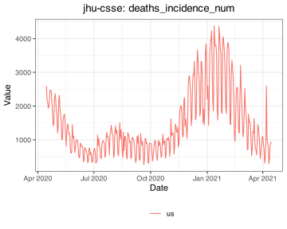

# covidcast R package

<!-- README.md is generated from README.Rmd; edit that instead,
then use rmarkdown::render("README.Rmd") to regenerate -->

[](https://cran.r-project.org/package=covidcast)

Provides R access to the [COVIDcast Epidata
API](https://cmu-delphi.github.io/delphi-epidata/api/covidcast.html)
published by the [Delphi group](https://delphi.cmu.edu/) at [Carnegie
Mellon University](https://www.cmu.edu). This API provides daily access
to a range of COVID-related signals Delphi that builds and maintains,
from sources like symptom surveys and medical claims data, and also
standard signals that we simply mirror, like confirmed cases and deaths.

Fetching data in a data frame is as easy [selecting the signal you
want](https://cmu-delphi.github.io/delphi-epidata/api/covidcast_signals.html)
and then using `covidcast_signal()`:

``` r
library(covidcast)

deaths <- covidcast_signal("jhu-csse", "deaths_incidence_num",
                           "2020-04-15", "2021-04-15",
                           geo_type = "nation")
plot(deaths, plot_type = "line")
```

<!-- -->

The package supports convenient plotting and mapping tools, correlation
analyses between signals, and various geographic utilities for working
with counties, metropolitan areas, and other units.

Consult the [COVIDcast Epidata API
documentation](https://cmu-delphi.github.io/delphi-epidata/api/covidcast.html)
for details on the data included in the API, licensing, and how to cite
this data in your work. The [signals
documentation](https://cmu-delphi.github.io/delphi-epidata/api/covidcast_signals.html)
lists all the data sources and signals available through this API.

**To get started** using this package, view the Getting Started guide at
`vignette("covidcast")`.

## Get updates

**You should consider subscribing to the [API mailing
list](https://lists.andrew.cmu.edu/mailman/listinfo/delphi-covidcast-api)**
to be notified of package updates, new data sources, corrections, and
other updates.

## Usage terms and citation

We request that if you use the covidcast package in your work, or use
any of the data provided by the COVIDcast Epidata API, that you cite us
appropriately:

Arnold T, Bien J, Brooks L, Colquhoun S, Farrow D, Grabman J,
Maynard-Zhang P, Reinhart A, Tibshirani R (2022). *covidcast: Client for
Delphi’s COVIDcast Epidata API*. R package version 0.4.3,
<https://cmu-delphi.github.io/covidcast/covidcastR/>.

Reinhart A, Brooks L, Jahja M, Rumack A, Tang J, Agrawal S, Saeed WA,
Arnold T, Basu A, Bien J, Cabrera ÁA, Chin A, Chua EJ, Clark B,
Colquhoun S, DeFries N, Farrow DC, Forlizzi J, Grabman J, Gratzl S,
Green A, Haff G, Han R, Harwood K, Hu AJ, Hyde R, Hyun S, Joshi A, Kim
J, Kuznetsov A, La Motte-Kerr W, Lee YJ, Lee K, Lipton ZC, Liu MX,
Mackey L, Mazaitis K, McDonald DJ, McGuinness P, Narasimhan B, O’Brien
MP, Oliveira NL, Patil P, Perer A, Politsch CA, Rajanala S, Rucker D,
Scott C, Shah NH, Shankar V, Sharpnack J, Shemetov D, Simon N, Smith BY,
Srivastava V, Tan S, Tibshirani R, Tuzhilina E, Van Nortwick AK, Ventura
V, Wasserman L, Weaver B, Weiss JC, Whitman S, Williams K, Rosenfeld R,
Tibshirani RJ (2021). “An open repository of real-time COVID-19
indicators.” *Proceedings of the National Academy of Sciences*,
*118*(51). <doi:10.1073/pnas.2111452118>
<https://doi.org/10.1073/pnas.2111452118>.

See the [COVIDcast Epidata licensing
documentation](https://cmu-delphi.github.io/delphi-epidata/api/covidcast_licensing.html)
for information about citing the datasets provided by the API.

**Warning:** If you use data from the COVIDcast API to power a product,
dashboard, app, or other service, please download the data you need and
store it centrally rather than making API requests for every user. Our
server resources are limited and cannot support high-volume interactive
use.

See also the [COVIDcast Terms of
Use](https://delphi.cmu.edu/covidcast/terms-of-use/), noting that the
data is a research product and not warranted for a particular purpose.
