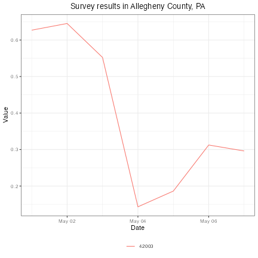

This package provides access to data frames of values from the [COVIDcast
endpoint of the Epidata
API](https://cmu-delphi.github.io/delphi-epidata/api/covidcast.html). Using the
`covidcast_signal()` function, you can fetch any data you may be interested in
analyzing, then use `plot.covidcast_signal()` to make plots and maps. Since the
data is provided as a simple data frame, you can also wrangle it into whatever
form you need to conduct your desired analyses using other packages and
functions.

## Installing

This package is [available on
CRAN](https://cran.r-project.org/package=covidcast), so the easiest way to
install it is simply

```r
install.packages("covidcast")
```

## Basic examples

To obtain smoothed estimates of COVID-like illness from our [COVID-19 Trends and
Impact Survey](https://delphi.cmu.edu/covidcast/surveys/) for every county in
the United States between 2020-05-01 and 2020-05-07, we can use
`covidcast_signal()`:


```r
library(covidcast)
library(dplyr)

cli <- covidcast_signal(data_source = "fb-survey", signal = "smoothed_wcli",
                        start_day = "2020-05-01", end_day = "2020-05-07",
                        geo_type = "county")
knitr::kable(head(cli))
```


|data_source |signal        |geo_value |time_value |source    |geo_type |time_type |issue      | lag| missing_value| missing_stderr| missing_sample_size|     value|    stderr| sample_size|
|:-----------|:-------------|:---------|:----------|:---------|:--------|:---------|:----------|---:|-------------:|--------------:|-------------------:|---------:|---------:|-----------:|
|fb-survey   |smoothed_wcli |01000     |2020-05-01 |fb-survey |county   |day       |2020-09-03 | 125|             0|              0|                   0| 0.8260625| 0.1341381|   1676.2773|
|fb-survey   |smoothed_wcli |01001     |2020-05-01 |fb-survey |county   |day       |2020-09-03 | 125|             0|              0|                   0| 1.0707790| 0.8213119|    109.0866|
|fb-survey   |smoothed_wcli |01003     |2020-05-01 |fb-survey |county   |day       |2020-09-03 | 125|             0|              0|                   0| 0.5081644| 0.2800777|    572.3194|
|fb-survey   |smoothed_wcli |01015     |2020-05-01 |fb-survey |county   |day       |2020-09-03 | 125|             0|              0|                   0| 0.5277609| 0.5192431|    118.8275|
|fb-survey   |smoothed_wcli |01031     |2020-05-01 |fb-survey |county   |day       |2020-09-03 | 125|             0|              0|                   0| 0.3733811| 0.3367309|    112.2687|
|fb-survey   |smoothed_wcli |01045     |2020-05-01 |fb-survey |county   |day       |2020-09-03 | 125|             0|              0|                   0| 1.2369542| 0.6464530|    108.5803|

`covidcast_signal()` returns a data frame. (Here we're using `knitr::kable()` to
make it more readable.) Each row represents one observation in one county on one
day. The county FIPS code is given in the `geo_value` column, the date in the
`time_value` column. Here `value` is the requested signal---in this case, the
smoothed estimate of the percentage of people with COVID-like illness, based on
the symptom surveys, and `stderr` is its standard error. See the
`covidcast_signal()` documentation for details on the returned data frame.

To get a basic summary of the returned data frame:


```r
summary(cli)
```

```
A `covidcast_signal` dataframe with 7030 rows and 15 columns.

data_source : fb-survey
signal      : smoothed_wcli
geo_type    : county

first date                          : 2020-05-01
last date                           : 2020-05-07
median number of geo_values per day : 1015
```

The COVIDcast API makes estimates available at several different geographic
levels, and `covidcast_signal()` defaults to requesting county-level data. To
request estimates for states instead of counties, we use the `geo_type`
argument:


```r
cli <- covidcast_signal(data_source = "fb-survey", signal = "smoothed_wcli",
                        start_day = "2020-05-01", end_day = "2020-05-07",
                        geo_type = "state")
knitr::kable(head(cli))
```


|data_source |signal        |geo_value |time_value |source    |geo_type |time_type |issue      | lag| missing_value| missing_stderr| missing_sample_size|     value|    stderr| sample_size|
|:-----------|:-------------|:---------|:----------|:---------|:--------|:---------|:----------|---:|-------------:|--------------:|-------------------:|---------:|---------:|-----------:|
|fb-survey   |smoothed_wcli |ak        |2020-05-01 |fb-survey |state    |day       |2020-09-03 | 125|             0|              0|                   0| 0.3661909| 0.1469918|    1560.000|
|fb-survey   |smoothed_wcli |al        |2020-05-01 |fb-survey |state    |day       |2020-09-03 | 125|             0|              0|                   0| 0.7764020| 0.1010989|    7360.237|
|fb-survey   |smoothed_wcli |ar        |2020-05-01 |fb-survey |state    |day       |2020-09-03 | 125|             0|              0|                   0| 0.7065584| 0.1051584|    4781.483|
|fb-survey   |smoothed_wcli |az        |2020-05-01 |fb-survey |state    |day       |2020-09-03 | 125|             0|              0|                   0| 0.6025853| 0.0724214|   10973.073|
|fb-survey   |smoothed_wcli |ca        |2020-05-01 |fb-survey |state    |day       |2020-09-03 | 125|             0|              0|                   0| 0.4139045| 0.0306336|   50482.138|
|fb-survey   |smoothed_wcli |co        |2020-05-01 |fb-survey |state    |day       |2020-09-03 | 125|             0|              0|                   0| 0.5984794| 0.0717395|    9888.894|

One can also select a specific geographic region by its ID. For example, this is
the FIPS code for Allegheny County, Pennsylvania:


```r
cli <- covidcast_signal(data_source = "fb-survey", signal = "smoothed_wcli",
                        start_day = "2020-05-01", end_day = "2020-05-07",
                        geo_type = "county", geo_value = "42003")
knitr::kable(head(cli))
```


|data_source |signal        |geo_value |time_value |source    |geo_type |time_type |issue      | lag| missing_value| missing_stderr| missing_sample_size|     value|    stderr| sample_size|
|:-----------|:-------------|:---------|:----------|:---------|:--------|:---------|:----------|---:|-------------:|--------------:|-------------------:|---------:|---------:|-----------:|
|fb-survey   |smoothed_wcli |42003     |2020-05-01 |fb-survey |county   |day       |2020-09-03 | 125|             0|              0|                   0| 0.6270520| 0.2511377|    2554.564|
|fb-survey   |smoothed_wcli |42003     |2020-05-02 |fb-survey |county   |day       |2020-09-03 | 124|             0|              0|                   0| 0.6453498| 0.2599037|    2509.176|
|fb-survey   |smoothed_wcli |42003     |2020-05-03 |fb-survey |county   |day       |2020-09-03 | 123|             0|              0|                   0| 0.5523067| 0.2497662|    2473.456|
|fb-survey   |smoothed_wcli |42003     |2020-05-04 |fb-survey |county   |day       |2020-09-03 | 122|             0|              0|                   0| 0.1430772| 0.0804642|    2493.730|
|fb-survey   |smoothed_wcli |42003     |2020-05-05 |fb-survey |county   |day       |2020-09-03 | 121|             0|              0|                   0| 0.1861889| 0.0960907|    2415.204|
|fb-survey   |smoothed_wcli |42003     |2020-05-06 |fb-survey |county   |day       |2020-09-03 | 120|             0|              0|                   0| 0.3124150| 0.1218194|    2465.422|

### API keys

By default, this package submits queries to the API anonymously. All the
examples in the package documentation are compatible with anonymous use of the
API, but [there are some limits on anonymous
queries](https://cmu-delphi.github.io/delphi-epidata/api/api_keys.html),
including rate limits on the number of queries that can be submitted per hour.
To lift these limits, see the "API keys" section of the `covidcast_signal()`
documentation for information on how to register for and use an API key.

### Plotting and mapping

This package provides convenient functions for plotting and mapping these
signals. For example, simple line charts are easy to construct:


```r
plot(cli, plot_type = "line",
     title = "Survey results in Allegheny County, PA")
```



For more details and examples, including choropleth and bubble maps, see
`vignette("plotting-signals")`.


### Finding signals of interest

Above we used data from [Delphi's symptom
surveys](https://delphi.cmu.edu/covid19/ctis/), but the COVIDcast API includes
numerous data streams: medical claims data, cases and deaths, mobility, and many
others; new signals are added regularly. This can make it a challenge to find
the data stream that you are most interested in.

The [COVIDcast Data Sources and Signals
documentation](https://cmu-delphi.github.io/delphi-epidata/api/covidcast_signals.html)
lists all data sources and signals available through COVIDcast. When you find a
signal of interest, get the data source name (such as `jhu-csse` or `fb-survey`)
and the signal name (such as `confirmed_incidence_num` or `smoothed_wcli`).
These are provided as arguments to `covidcast_signal()` to request the data you
want.


### Finding counties and metro areas

The COVIDcast API identifies counties by their 5-digit FIPS code and
metropolitan areas by their CBSA ID number. (See the [geographic coding
documentation](https://cmu-delphi.github.io/delphi-epidata/api/covidcast_geography.html)
for details.) This means that to query a specific county or metropolitan area,
we must have some way to quickly find its identifier.

This package includes several utilities intended to make the process easier. For
example, if we look at `?county_census`, we find that the package provides
census data (such as population) on every county in the United States, including
its FIPS code. Similarly, by looking at `?msa_census` we can find data about
metropolitan statistical areas, their corresponding CBSA IDs, and recent census
data.

(Note: the `msa_census` data includes types of area beyond metropolitan
statistical areas, including micropolitan statistical areas. The `LSAD` column
identifies the type of each area. The COVIDcast API only provides estimates for
metropolitan statistical areas, not for their divisions or for micropolitan
areas.)

Building on these datasets, the convenience functions `name_to_fips()` and
`name_to_cbsa()` conduct `grep()`-based searching of county or metropolitan area
names to find FIPS or CBSA codes, respectively:


```r
name_to_fips("Allegheny")
```

```
Allegheny County 
         "42003" 
```

```r
name_to_cbsa("Pittsburgh")
```

```
Pittsburgh, PA 
       "38300" 
```

Since these functions return vectors of IDs, we can use them to construct the
`geo_values` argument to `covidcast_signal()` to select specific regions to
query.

You may also want to convert FIPS codes or CBSA IDs back to well-known names,
for instance to report in tables or graphics. The package provides inverse
mappings `county_fips_to_name()` and `cbsa_to_name()` that work in the
analogous way:


```r
county_fips_to_name("42003")
```

```
             42003 
"Allegheny County" 
```

```r
cbsa_to_name("38300")
```

```
           38300 
"Pittsburgh, PA" 
```

See their documentation for more details (for example, the options for handling
matches when counties have the same name).

## Signal metadata

If we are interested in exploring the available signals and their metadata, we
can use `covidcast_meta()` to fetch a data frame of the available signals:


```r
meta <- covidcast_meta()
knitr::kable(head(meta))
```


|data_source |signal                      |time_type |geo_type |min_time   |max_time   | num_locations| min_value| max_value| mean_value| stdev_value| last_update|max_issue  | min_lag| max_lag|
|:-----------|:---------------------------|:---------|:--------|:----------|:----------|-------------:|---------:|---------:|----------:|-----------:|-----------:|:----------|-------:|-------:|
|chng        |smoothed_adj_outpatient_cli |day       |county   |2020-02-01 |2023-02-14 |          3118| 0.0009331|  99.92012|   2.227852|    3.843579|  1683566979|2023-02-19 |       3|     674|
|chng        |smoothed_adj_outpatient_cli |day       |hhs      |2020-02-01 |2023-06-14 |            10| 0.0061953|  20.77577|   2.530157|    2.531306|  1687231582|2023-06-19 |       5|     674|
|chng        |smoothed_adj_outpatient_cli |day       |hrr      |2020-02-01 |2023-06-14 |           306| 0.0010292|  50.81590|   2.350355|    2.763442|  1687231582|2023-06-19 |       5|     674|
|chng        |smoothed_adj_outpatient_cli |day       |msa      |2020-02-01 |2023-06-14 |           392| 0.0007662|  99.99898|   2.153204|    3.000248|  1687231583|2023-06-19 |       5|     674|
|chng        |smoothed_adj_outpatient_cli |day       |nation   |2020-02-01 |2023-06-14 |             1| 0.0154639|  12.08697|   2.778260|    2.344107|  1687231583|2023-06-19 |       5|     674|
|chng        |smoothed_adj_outpatient_cli |day       |state    |2020-02-01 |2023-06-14 |            55| 0.0013343|  33.23859|   2.264207|    2.563880|  1687231583|2023-06-19 |       5|     674|

The `covidcast_meta()` documentation describes the columns and their meanings.
The metadata data frame can be filtered and sliced as desired to obtain
information about signals of interest. To get a basic summary of the metadata:


```r
summary(meta)
```

(We silenced the evaluation because the output of `summary()` here is still
quite long.)

## Tracking issues and updates

The COVIDcast API records not just each signal's estimate for a given location
on a given day, but also *when* that estimate was made, and all updates to that
estimate.

For example, consider using our [doctor visits
signal](https://cmu-delphi.github.io/delphi-epidata/api/covidcast-signals/doctor-visits.html),
which estimates the percentage of outpatient doctor visits that are
COVID-related, and consider a result row with `time_value` 2020-05-01 for
`geo_values = "pa"`. This is an estimate for the percentage in Pennsylvania on
May 1, 2020. That estimate was *issued* on May 5, 2020, the delay being due to
the aggregation of data by our source and the time taken by the COVIDcast API to
ingest the data provided. Later, the estimate for May 1st could be updated,
perhaps because additional visit data from May 1st arrived at our source and was
reported to us. This constitutes a new *issue* of the data.

### Data known "as of" a specific date

By default, `covidcast_signal()` fetches the most recent issue available. This
is the best option for users who simply want to graph the latest data or
construct dashboards. But if we are interested in knowing *when* data was
reported, we can request specific data versions using the `as_of`, `issues`, or
`lag` arguments. (Note these are mutually exclusive; only one can be specified
at a time.)

First, we can request the data that was available *as of* a specific date, using
the `as_of` argument:


```r
covidcast_signal(data_source = "doctor-visits", signal = "smoothed_adj_cli",
                 start_day = "2020-05-01", end_day = "2020-05-01",
                 geo_type = "state", geo_values = "pa", as_of = "2020-05-07")
```

```
A `covidcast_signal` dataframe with 1 rows and 15 columns.

data_source : doctor-visits
signal      : smoothed_adj_cli
geo_type    : state

    data_source           signal geo_value time_value        source geo_type
1 doctor-visits smoothed_adj_cli        pa 2020-05-01 doctor-visits    state
  time_type      issue lag missing_value missing_stderr missing_sample_size
1       day 2020-05-07   6             0              5                   5
     value stderr sample_size
1 2.581509     NA          NA
```

This shows that an estimate of about 2.3% was issued on May 7. If we don't
specify `as_of`, we get the most recent estimate available:


```r
covidcast_signal(data_source = "doctor-visits", signal = "smoothed_adj_cli",
                 start_day = "2020-05-01", end_day = "2020-05-01",
                 geo_type = "state", geo_values = "pa")
```

```
A `covidcast_signal` dataframe with 1 rows and 15 columns.

data_source : doctor-visits
signal      : smoothed_adj_cli
geo_type    : state

    data_source           signal geo_value time_value        source geo_type
1 doctor-visits smoothed_adj_cli        pa 2020-05-01 doctor-visits    state
  time_type      issue lag missing_value missing_stderr missing_sample_size
1       day 2020-07-04  64             0              5                   5
     value stderr sample_size
1 5.973572     NA          NA
```

Note the substantial change in the estimate, to over 5%, reflecting new data
that became available *after* May 7 about visits occurring on May 1. This
illustrates the importance of issue date tracking, particularly for forecasting
tasks. To backtest a forecasting model on past data, it is important to use the
data that would have been available *at the time*, not data that arrived much
later.

### Multiple issues of observations

By using the `issues` argument, we can request all issues in a certain time
period:


```r
covidcast_signal(data_source = "doctor-visits", signal = "smoothed_adj_cli",
                 start_day = "2020-05-01", end_day = "2020-05-01",
                 geo_type = "state", geo_values = "pa",
                 issues = c("2020-05-01", "2020-05-15")) %>%
  knitr::kable()
```


|data_source   |signal           |geo_value |time_value |source        |geo_type |time_type |issue      | lag| missing_value| missing_stderr| missing_sample_size|    value|stderr |sample_size |
|:-------------|:----------------|:---------|:----------|:-------------|:--------|:---------|:----------|---:|-------------:|--------------:|-------------------:|--------:|:------|:-----------|
|doctor-visits |smoothed_adj_cli |pa        |2020-05-01 |doctor-visits |state    |day       |2020-05-07 |   6|             0|              5|                   5| 2.581509|NA     |NA          |
|doctor-visits |smoothed_adj_cli |pa        |2020-05-01 |doctor-visits |state    |day       |2020-05-08 |   7|             0|              5|                   5| 3.278896|NA     |NA          |
|doctor-visits |smoothed_adj_cli |pa        |2020-05-01 |doctor-visits |state    |day       |2020-05-09 |   8|             0|              5|                   5| 3.321781|NA     |NA          |
|doctor-visits |smoothed_adj_cli |pa        |2020-05-01 |doctor-visits |state    |day       |2020-05-12 |  11|             0|              5|                   5| 3.588683|NA     |NA          |
|doctor-visits |smoothed_adj_cli |pa        |2020-05-01 |doctor-visits |state    |day       |2020-05-13 |  12|             0|              5|                   5| 3.631978|NA     |NA          |
|doctor-visits |smoothed_adj_cli |pa        |2020-05-01 |doctor-visits |state    |day       |2020-05-14 |  13|             0|              5|                   5| 3.658009|NA     |NA          |
|doctor-visits |smoothed_adj_cli |pa        |2020-05-01 |doctor-visits |state    |day       |2020-05-15 |  14|             0|              5|                   5| 3.662286|NA     |NA          |

This estimate was clearly updated many times as new data for May 1st arrived.
Note that these results include only data issued or updated between 2020-05-01
and 2020-05-15. If a value was first reported on 2020-04-15, and never updated,
a query for issues between 2020-05-01 and 2020-05-15 will not include that value
among its results.

After fetching multiple issues of data, we can use the `latest_issue()` or
`earliest_issue()` functions to subset the data frame to view only the latest or
earliest issue of each observation.

### Observations issued with a specific lag

Finally, we can use the `lag` argument to request only data reported with a
certain lag. For example, requesting a lag of 7 days means to request only
issues 7 days after the corresponding `time_value`:


```r
covidcast_signal(data_source = "doctor-visits", signal = "smoothed_adj_cli",
                 start_day = "2020-05-01", end_day = "2020-05-07",
                 geo_type = "state", geo_values = "pa", lag = 7) %>%
  knitr::kable()
```

```
Warning: Data not fetched for the following days: 2020-05-01
```


|data_source   |signal           |geo_value |time_value |source        |geo_type |time_type |issue      | lag| missing_value| missing_stderr| missing_sample_size|    value|stderr |sample_size |
|:-------------|:----------------|:---------|:----------|:-------------|:--------|:---------|:----------|---:|-------------:|--------------:|-------------------:|--------:|:------|:-----------|
|doctor-visits |smoothed_adj_cli |pa        |2020-05-01 |doctor-visits |state    |day       |2020-05-08 |   7|             0|              5|                   5| 3.278896|NA     |NA          |
|doctor-visits |smoothed_adj_cli |pa        |2020-05-02 |doctor-visits |state    |day       |2020-05-09 |   7|             0|              5|                   5| 3.225292|NA     |NA          |
|doctor-visits |smoothed_adj_cli |pa        |2020-05-05 |doctor-visits |state    |day       |2020-05-12 |   7|             0|              5|                   5| 2.779908|NA     |NA          |
|doctor-visits |smoothed_adj_cli |pa        |2020-05-06 |doctor-visits |state    |day       |2020-05-13 |   7|             0|              5|                   5| 2.557698|NA     |NA          |
|doctor-visits |smoothed_adj_cli |pa        |2020-05-07 |doctor-visits |state    |day       |2020-05-14 |   7|             0|              5|                   5| 2.191677|NA     |NA          |

Note that though this query requested all values between 2020-05-01 and
2020-05-07, May 3rd and May 4th were *not* included in the results set. This is
because the query will only include a result for May 3rd if a value were issued
on May 10th (a 7-day lag), but in fact the value was not updated on that day:


```r
covidcast_signal(data_source = "doctor-visits", signal = "smoothed_adj_cli",
                 start_day = "2020-05-03", end_day = "2020-05-03",
                 geo_type = "state", geo_values = "pa",
                 issues = c("2020-05-09", "2020-05-15")) %>%
  knitr::kable()
```


|data_source   |signal           |geo_value |time_value |source        |geo_type |time_type |issue      | lag| missing_value| missing_stderr| missing_sample_size|    value|stderr |sample_size |
|:-------------|:----------------|:---------|:----------|:-------------|:--------|:---------|:----------|---:|-------------:|--------------:|-------------------:|--------:|:------|:-----------|
|doctor-visits |smoothed_adj_cli |pa        |2020-05-03 |doctor-visits |state    |day       |2020-05-09 |   6|             0|              5|                   5| 2.788618|NA     |NA          |
|doctor-visits |smoothed_adj_cli |pa        |2020-05-03 |doctor-visits |state    |day       |2020-05-12 |   9|             0|              5|                   5| 3.015368|NA     |NA          |
|doctor-visits |smoothed_adj_cli |pa        |2020-05-03 |doctor-visits |state    |day       |2020-05-13 |  10|             0|              5|                   5| 3.039310|NA     |NA          |
|doctor-visits |smoothed_adj_cli |pa        |2020-05-03 |doctor-visits |state    |day       |2020-05-14 |  11|             0|              5|                   5| 3.021245|NA     |NA          |
|doctor-visits |smoothed_adj_cli |pa        |2020-05-03 |doctor-visits |state    |day       |2020-05-15 |  12|             0|              5|                   5| 3.048725|NA     |NA          |
