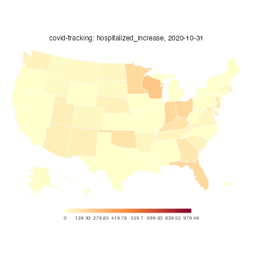

While the COVIDcast Epidata API provides numerous useful COVID data streams, you
may sometimes find yourself with relevant data from a different source. This
package provides the tools you need to load such data and use it alongside
COVIDcast data---for example, you can calculate correlations with
`covidcast_cor()` and make maps using `plot.covidcast_signal()`.

Let's illustrate this in action using data from the [COVID Tracking
Project](https://covidtracking.com/). They provide [CSV files for
download](https://covidtracking.com/data/download/) containing daily state-level
data on numerous metrics, including cases, deaths, hospitalizations, and test
results.

## Loading the data

We've saved a sample of the data in this package to use as an example. Let's
load it and examine a few columns using `knitr::kable()` to print them nicely:


```r
library(dplyr)

data <- read.csv(system.file("extdata", "covid-tracking-project-oct-2020.csv",
                             package = "covidcast", mustWork = TRUE))

data %>%
    select(date, state, death, deathIncrease, hospitalizedCurrently,
           hospitalizedIncrease) %>%
    head() %>%
    knitr::kable()
```


|date       |state | death| deathIncrease| hospitalizedCurrently| hospitalizedIncrease|
|:----------|:-----|-----:|-------------:|---------------------:|--------------------:|
|2020-10-31 |AK    |    82|             1|                    94|                    7|
|2020-10-31 |AL    |  2967|            35|                   960|                    0|
|2020-10-31 |AR    |  1925|            25|                   652|                   35|
|2020-10-31 |AS    |     0|             0|                    NA|                    0|
|2020-10-31 |AZ    |  5979|            45|                   889|                   68|
|2020-10-31 |CA    | 17626|            55|                  3212|                    0|

This is in a convenient format: Each day's observations for each state are in
one row. Suppose we would like to extract `hospitalizedIncrease` as a signal we
want to map and analyze alongside other data fetched with `covidcast_signal()`.

To do this, we use `as.covidcast_signal()`. It expects a data frame with at
least three columns:

* `time_value`: a `Date` object giving the observation date
* `value`: the value of the observation, such as the number of deaths or
  hospitalizations
* `geo_value`: the location, such as state or county, in the same form as
  returned by `covidcast_signal()` (such as two-letter lowercase abbreviations
  for states and FIPS codes for counties)

Other columns are preserved unchanged. (In particular, if an `issue` column is
present, it is used as the issue date of each observation. This is important if
your data source includes multiple revisions of each observation.)
`as.covidcast_signal()` also needs to know the `geo_type` (state, in this case)
and source/signal name to apply to the data. With a bit of
[dplyr](https://dplyr.tidyverse.org/) data wrangling, we can do this easily:


```r
library(covidcast)

hospitalized <- data %>%
    select(time_value = date,
           geo_value = state,
           value = hospitalizedIncrease) %>%
    mutate(geo_value = tolower(geo_value),
           time_value = as.Date(time_value)) %>%
    as.covidcast_signal(geo_type = "state",
                        data_source = "covid-tracking",
                        signal = "hospitalized_increase")

head(hospitalized) %>%
    knitr::kable()
```


|data_source    |signal                |geo_value |time_value | value|issue      |
|:--------------|:---------------------|:---------|:----------|-----:|:----------|
|covid-tracking |hospitalized_increase |ak        |2020-10-31 |     7|2023-07-12 |
|covid-tracking |hospitalized_increase |al        |2020-10-31 |     0|2023-07-12 |
|covid-tracking |hospitalized_increase |ar        |2020-10-31 |    35|2023-07-12 |
|covid-tracking |hospitalized_increase |as        |2020-10-31 |     0|2023-07-12 |
|covid-tracking |hospitalized_increase |az        |2020-10-31 |    68|2023-07-12 |
|covid-tracking |hospitalized_increase |ca        |2020-10-31 |     0|2023-07-12 |

This allows us to make maps using the same functions used for other COVIDcast
data:


```r
plot(hospitalized, plot_type = "choro")
```

```
Warning: Metadata for signal mean and standard deviation not available;
defaulting to observed mean and standard deviation to set plot range.
```



## Analysis alongside other signals

Now that our data is loaded as a `covidcast_signal` object, we can use it
alongside other signals from the API. For example, let's examine how new COVID
hospitalizations correlate with outpatient doctor visits with deaths during
October 2020, where we use death data as reported by the API.


```r
deaths <- covidcast_signal("jhu-csse", "deaths_7dav_incidence_prop",
                           start_day = "2020-10-01",
                           end_day = "2020-10-31",
                           geo_type = "state")

covidcast_cor(deaths, hospitalized, by = "time_value")
```

```
# A tibble: 31 × 2
   time_value  value
   <date>      <dbl>
 1 2020-10-01 0.218 
 2 2020-10-02 0.120 
 3 2020-10-03 0.147 
 4 2020-10-04 0.148 
 5 2020-10-05 0.0436
 6 2020-10-06 0.0706
 7 2020-10-07 0.123 
 8 2020-10-08 0.0300
 9 2020-10-09 0.0955
10 2020-10-10 0.178 
# ℹ 21 more rows
```

We can also use the tools provided by this package to place both signals into a
single data frame for analysis. For example, to build a model that uses
hospitalizations and other data to predict deaths, it may be convenient to
produce a data frame where each row represents one state on one day, and each
column is a variable (such as hospitalization or death). Using
`aggregate_signals()`, this is easy:


```r
death_hosp <- aggregate_signals(list(deaths, hospitalized),
                                format = "wide")

head(death_hosp) %>%
    knitr::kable()
```


|geo_value |time_value | value+0:jhu-csse_deaths_7dav_incidence_prop| value+0:covid-tracking_hospitalized_increase|
|:---------|:----------|-------------------------------------------:|--------------------------------------------:|
|ca        |2020-10-01 |                                   0.2286116|                                            0|
|ca        |2020-10-02 |                                   0.2137337|                                            0|
|ca        |2020-10-03 |                                   0.2122822|                                            0|
|ca        |2020-10-04 |                                   0.2122822|                                            0|
|ca        |2020-10-05 |                                   0.2177254|                                            0|
|ca        |2020-10-06 |                                   0.1788977|                                            0|
