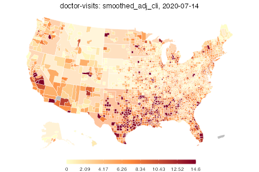
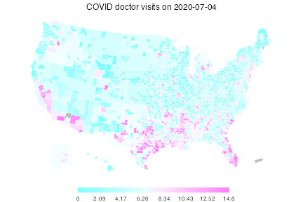
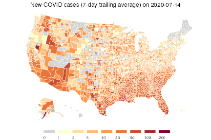
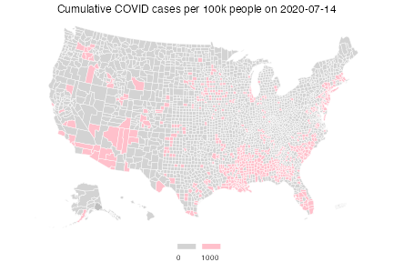
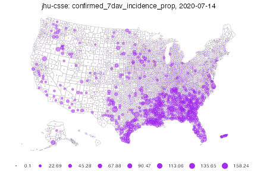
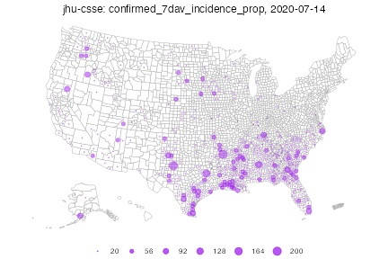
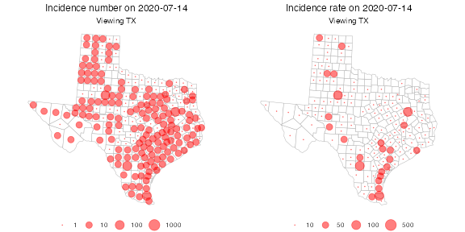
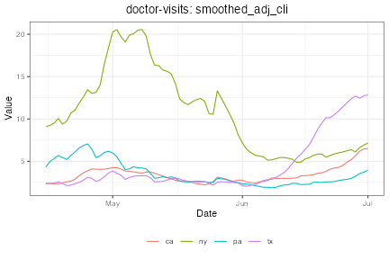
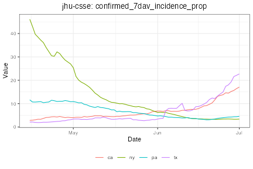
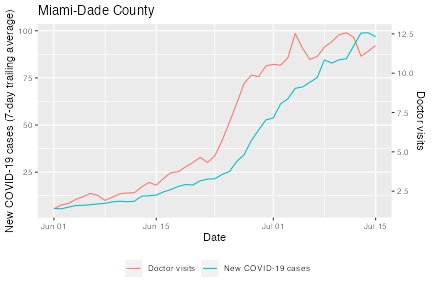

Once you've fetched some COVIDcast signals using `covidcast_signal()`, the
returned `covidcast` objects can be plotted and mapped in various ways. The data
structure is designed to be tidy and easily wrangled using your favorite
packages, but the covidcast package also provides some tools for plotting and
mapping signals in an easy way.

For this vignette, we'll use our [doctor visits
signal](https://cmu-delphi.github.io/delphi-epidata/api/covidcast-signals/doctor-visits.html)
as an example; it records the percentage of outpatient doctor visits with COVID
symptom codes, as reported by Delphi's health system partners. We'll also use
incident case counts. Fetching the data is simple:


```r
library(covidcast)

dv <- covidcast_signal(data_source = "doctor-visits",
                       signal = "smoothed_adj_cli",
                       start_day = "2020-07-01", end_day = "2020-07-14")
summary(dv)
```

```
A `covidcast_signal` dataframe with 28450 rows and 15 columns.

data_source : doctor-visits
signal      : smoothed_adj_cli
geo_type    : county

first date                          : 2020-07-01
last date                           : 2020-07-14
median number of geo_values per day : 2035
```

```r
inum <- covidcast_signal(data_source = "jhu-csse",
                         signal = "confirmed_7dav_incidence_prop",
                         start_day = "2020-07-01", end_day = "2020-07-14")
summary(inum)
```

```
A `covidcast_signal` dataframe with 45864 rows and 15 columns.

data_source : jhu-csse
signal      : confirmed_7dav_incidence_prop
geo_type    : county

first date                          : 2020-07-01
last date                           : 2020-07-14
median number of geo_values per day : 3276
```

## Choropleth maps


The default `plot` method for `covidcast_signal` objects,
`plot.covidcast_signal()`, produces choropleth maps by using `ggplot2` and the
`usmap` package:


```r
plot(dv)
```



The color scheme is automatically chosen to be similar to that used on the
online [COVIDcast mapping tool](https://delphi.cmu.edu/covidcast/). Also, by
default, this map shows the most recent day of data available in the data frame.
One can choose the day and also choose the color scales, transparency level for
mega counties, and title:


```r
plot(dv, time_value = "2020-07-04", choro_col = cm.colors(10), alpha = 0.4,
     title = "COVID doctor visits on 2020-07-04")
```



By providing `breaks` and `colors`, we can create custom color scales, for
example to have a log-spaced color scale for incident case counts:


```r
breaks <- c(0, 1, 2, 5, 10, 20, 50, 100, 200)
colors <- c("#D3D3D3", "#FFFFCC", "#FEDDA2", "#FDBB79", "#FD9950", "#EB7538",
            "#C74E32", "#A3272C", "#800026")

# Note that length(breaks) == length(colors) by design. This works as follows:
# we assign colors[i] iff the value satisfies breaks[i] <= value < breaks[i+1],
# where we take breaks[0] = -Inf and breaks[N+1] = Inf, for N = length(breaks)

plot(inum, choro_col = colors, choro_params = list(breaks = breaks),
     title = "New COVID cases (7-day trailing average) on 2020-07-14")
```



Lastly, we show how we can use custom breaks to (visually) answer the question:
which counties have cumulative case rates of at least 1/100?


```r
cprop <- covidcast_signal(data_source = "jhu-csse",
                          signal = "confirmed_cumulative_prop",
                          start_day = "2020-07-01", end_day = "2020-07-14")

breaks <- c(0, 1000)
colors <- c("#D3D3D3", "#FFC0CB")

plot(cprop, choro_col = colors,
     choro_params = list(breaks = breaks, legend_width = 3),
     title = "Cumulative COVID cases per 100k people on 2020-07-14")
```



## Bubble maps

As an alternative to choropleth maps, we can also quickly plot bubble maps. By
default, bubble maps have 8 bubble size bins evenly spaced over the range, where
zero always means zero bubble size. The legend shows all bins, interpreted as
each bubble size meaning *at least* the corresponding value.


```r
plot(inum, plot_type = "bubble")
```

```
Warning in plot_bubble(x, time_value = time_value, include = include, range =
range, : Bubble maps can be hard to read when there is missing data;the
locations without data are filled in gray.
```



As before, we can of course set customized breaks. As values to the left of the
first bin do not get drawn, this map is much sparser, and highlights areas with
larger case counts.


```r
plot(inum, plot_type = "bubble",
     bubble_params = list(breaks = seq(20, 200, len = 6)))
```

```
Warning in plot_bubble(x, time_value = time_value, include = include, range =
range, : Bubble maps can be hard to read when there is missing data;the
locations without data are filled in gray.
```



As a final example, suppose we want to plot only counties in the state of Texas.
We'd like to compare counts per 100,000 against absolute counts, so we fetch the
proportion signal:


```r
iprop <- covidcast_signal(data_source = "jhu-csse",
                          signal = "confirmed_7dav_incidence_prop",
                          start_day = "2020-07-01", end_day = "2020-07-14")
```

Then we make two maps side-by-side with custom ranges:


```r
library(gridExtra)

breaks1 <- c(1, 10, 100, 1000)
breaks2 <- c(10, 50, 100, 500)

p1 <- plot(inum, plot_type = "bubble",
           bubble_params = list(breaks = breaks1, max_size = 6),
           include = "TX", bubble_col = "red",
           title = paste("Incidence number on", max(inum$time_value)))
p2 <- plot(iprop, plot_type = "bubble",
           bubble_params = list(breaks = breaks2, max_size = 6),
           include = "TX", bubble_col = "red",
           title = paste("Incidence rate on", max(iprop$time_value)))

grid.arrange(p1, p2, nrow = 1)
```



## Time series plots

Let's fetch the doctor visits and case counts, but for all states rather than
for all counties. This will make the time series plots more manageable.


```r
dv_st <- covidcast_signal(data_source = "doctor-visits",
                          signal = "smoothed_adj_cli",
                          start_day = "2020-04-15", end_day = "2020-07-01",
                          geo_type = "state")
inum_st <- covidcast_signal(data_source = "jhu-csse",
                            signal = "confirmed_7dav_incidence_prop",
                            start_day = "2020-04-15", end_day = "2020-07-01",
                            geo_type = "state")
```

By default, time series plots show all available data, including all
geographies. A line for every state would be unmanageable, so let's select a few
states and plot all data for them:


```r
library(dplyr)

states <- c("ca", "pa", "tx", "ny")
plot(dv_st %>% filter(geo_value %in% states), plot_type = "line")
```



```r
plot(inum_st %>% filter(geo_value %in% states), plot_type = "line")
```



Notice how in Texas, the doctor visits indicator rose several weeks in advance
of confirmed cases, suggesting the signal could be predictive.

## Manual plotting

Using `ggplot2` or your favorite plotting package, we can easily plot time
series manually, without using the `plot.covidcast_signal()` method. You can use
this to customize the appearance of your plots however you choose.

For example:


```r
library(ggplot2)

dv_md <- covidcast_signal(data_source = "doctor-visits",
                          signal = "smoothed_adj_cli",
                          start_day = "2020-06-01", end_day = "2020-07-15",
                          geo_values = name_to_fips("Miami-Dade"))
```

```
Fetched day 2020-06-01 to 2020-07-15: num_entries = 45
```

```r
inum_md <- covidcast_signal(data_source = "jhu-csse",
                            signal = "confirmed_7dav_incidence_prop",
                            start_day = "2020-06-01", end_day = "2020-07-15",
                            geo_values = name_to_fips("Miami-Dade"))
```

```
Fetched day 2020-06-01 to 2020-07-15: num_entries = 45
```

```r
# Compute the ranges of the two signals
range1 <- inum_md %>% select("value") %>% range
range2 <- dv_md %>% select("value") %>% range

# Function to transform from one range to another
trans <- function(x, from_range, to_range) {
  (x - from_range[1]) / (from_range[2] - from_range[1]) *
    (to_range[2] - to_range[1]) + to_range[1]
}

# Convenience functions for our two signal ranges
trans12 <- function(x) trans(x, range1, range2)
trans21 <- function(x) trans(x, range2, range1)

# Transform the doctor visits signal to the incidence range, then stack
# these rowwise into one data frame
df <- select(rbind(dv_md %>% mutate_at("value", trans21),
                   inum_md), c("time_value", "value"))
df$signal <- c(rep("Doctor visits", nrow(dv_md)),
               rep("New COVID-19 cases", nrow(inum_md)))

# Finally, plot both signals
ggplot(df, aes(x = time_value, y = value)) +
  labs(x = "Date", title = "Miami-Dade County") +
  geom_line(aes(color = signal)) +
  scale_y_continuous(
    name = "New COVID-19 cases (7-day trailing average)",
    sec.axis = sec_axis(trans12, name = "Doctor visits")
  ) +
  theme(legend.position = "bottom",
        legend.title = ggplot2::element_blank())
```



Again, we see that the doctor visits indicator starts rising several days before
the new COVID-19 cases do.
