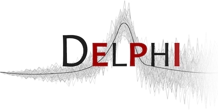

# modeltools R package 

This package is developed and maintained by the 
[**Delphi research group**](https://delphi.cmu.edu/) headquartered at Carnegie
Mellon University and is designed to be used in conjunction with our
[`covidcast`](https://cmu-delphi.github.io/covidcast/covidcastR) and 
[`evalcast`](https://cmu-delphi.github.io/covidcast/evalcastR) 
R packages. The `modeltools` package provides tools for analyzing the
trajectories of COVID-19 signals --- namely, those stored in Delphi's
[**COVIDcast Epidata API**](https://cmu-delphi.github.io/delphi-epidata/api/covidcast_signals.html) ---
and for building short-term forecasting models.

**To get started** using the `modeltools` package, see the
[**Getting started guide**](../../docs/modeltoolsR/articles/modeltools.html).

## Installation

The CRAN `modeltools` package is entirely unrelated to this one. Delphi's 
`modeltools` package can be installed from our
[**GitHub page**](https://github.com/cmu-delphi/covidcast/tree/main/R-packages/modeltools)
with the following command:

``` r
devtools::install_github(repo = "cmu-delphi/covidcast", subdir = "R-packages/modeltools")
```

## Presentations

Some talks we've given about the COVIDcast project: 

- [Intro to COVIDcast and API](https://cmu-delphi.github.io/covidcast/talks/intro-api/talk.html) 
- [Survey Through Facebook](https://cmu-delphi.github.io/covidcast/talks/fb-survey/talk.html)
- [Medical Claims Indicators](https://docs.google.com/presentation/d/1Pt2qMwIHyyuyGwwigZyndPGjcjILAS6RYxBcXKuuQ4U/edit?usp=sharing)
- [Forecast Evaluation Toolkit](https://cmu-delphi.github.io/covidcast/talks/evalcast/talk.html)
- [Overview Talk: Data, API, Surveys](https://cmu-delphi.github.io/covidcast/talks/copss-niss/talk.html)

## Related repos

- [delphi-epidata](https://github.com/cmu-delphi/delphi-epidata/): Back end for
  Delphi's Epidata API 
- [covidcast-indicators](https://github.com/cmu-delphi/covidcast-indicators/):
  Back end for Delphi's COVID indicators 
- [www-covidcast](https://github.com/cmu-delphi/www-covidcast/): Front end for
  Delphi's [COVIDcast map](https://covidcast.cmu.edu) 
- [covid-19-forecast](https://github.com/cmu-delphi/covid-19-forecast/): Public
  repo for Delphi's COVID forecasters 
