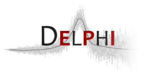

# modeltools <tt>R</tt> package 

This package is developed and maintained by the 
[**Delphi research group**](https://delphi.cmu.edu/) 
headquartered at Carnegie Mellon University and is designed to be used in 
conjunction with Delphi's
[`covidcast`](https://cmu-delphi.github.io/covidcast/covidcastR) and 
[`evalcast`](https://cmu-delphi.github.io/covidcast/evalcastR) 
<tt>R</tt> packages. The `modeltools` package provides tools for analyzing the
trajectories of COVID-19 data streams (particularly those stored in Delphi's
[**COVIDcast Epidata API**](https://cmu-delphi.github.io/delphi-epidata/api/covidcast_signals.html)), 
and for building short-term forecasting models.

**To get started** using the `modeltools` package, see the
[**Getting started**](../../docs/modeltoolsR/articles/modeltools.html)
guide.

## Get updates

You should consider subscribing to the 
[**Delphi COVIDcast Epidata API mailing list**](https://lists.andrew.cmu.edu/mailman/listinfo/delphi-covidcast-api)
to receive notifications of updates to Delphi's open-source software, changes 
to Delphi's COVIDcast Epidata API, new data sources added to the API, 
corrections to reported data, etc. The mailing list may also be used to ask 
general questions.

## Usage

**_Warning_:** This package is not on CRAN!

An <tt>R</tt> package named "`modeltools`" does exist on CRAN, but it is 
completely unrelated to this one. To install Delphi's `modeltools` package, 
please follow the installation instructions in the 
[**Getting started**](../../docs/modeltoolsR/articles/modeltools.html)
guide.

## Links

Browse the `modeltools` source code at:  
[https://github.com/cmu-delphi/covidcast/tree/main/R-packages/modeltools](https://github.com/cmu-delphi/covidcast/tree/main/R-packages/modeltools)

Report a bug at:  
[https://github.com/cmu-delphi/covidcast/issues](https://github.com/cmu-delphi/covidcast/issues)

Get the `covidcast` <tt>R</tt> package at:  
[https://cmu-delphi.github.io/covidcast/covidcastR](https://cmu-delphi.github.io/covidcast/covidcastR)

Get the `evalcast` <tt>R</tt> package at:  
[https://cmu-delphi.github.io/covidcast/evalcastR](https://cmu-delphi.github.io/covidcast/evalcastR)

## License
[MIT](https://opensource.org/licenses/mit-license.php)

## Citation

[Citing the <tt>modeltools</tt> package](../../docs/modeltoolsR/authors.html)

## Developers

<ul class="list-unstyled">
<li>Ryan J. Tibshirani 
<a href="https://orcid.org/0000-0002-2158-8304" target="orcid.widget" aria-label="ORCID"></a>
 <small class="roles"> Author, maintainer </small></li>
<li>Collin A. Politsch 
<a href="https://orcid.org/0000-0003-3727-9167" target="orcid.widget" aria-label="ORCID"></a>
 <small class="roles"> Author </small></li>
<li>Addison J. Hu 
<a href="https://orcid.org/0000-0002-9339-7291" target="orcid.widget" aria-label="ORCID"></a>
 <small class="roles"> Author </small></li>
<li><a href="../../docs/modeltoolsR/authors.html">All authors...</a></li>
</ul>
