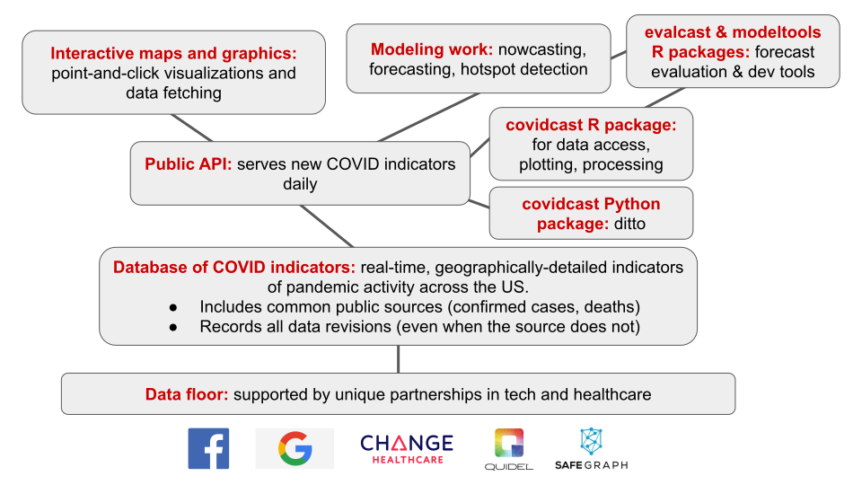
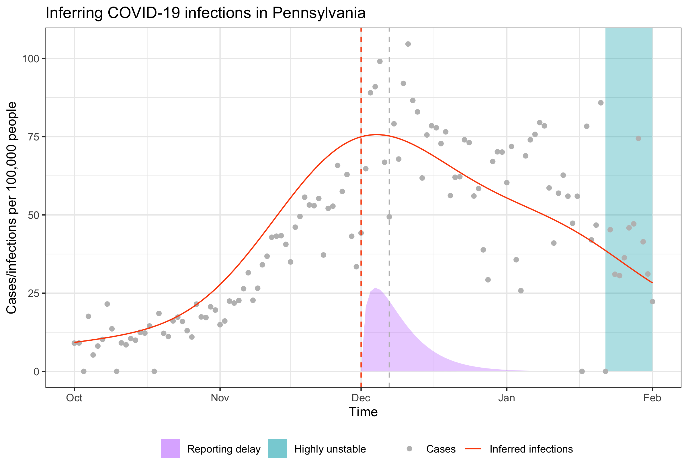

```{r, include = FALSE}
knitr::opts_chunk$set(message = FALSE, warning = FALSE, cache = TRUE, 
                      autodep = TRUE, cache.comments = TRUE)
library(dplyr)
library(purrr)
library(tidyr)
library(ggplot2)
library(gridExtra)
library(directlabels)

col = function(x, color = "#bb0000") {
  sprintf("<span style='color: %s;'>%s</span>", color, x)
}
```

# Delphi: Then and Now

- Delphi formed in 2012, to "develop the theory and practice of epidemic forecasting"
- Participated in annual CDC flu forecasting challenges since 2013, earned top place in several 
- Awarded `r col("CDC's National Center of Excellence")` for flu forecasting in 2019 
- March 2020: pivoted to focus on supporting the US COVID-19 response, launched `r col("COVIDcast")`
- We've been working on the "full pipeline", but have been focused, now more than ever, on data

# COVIDcast Indicators


# COVIDcast Ecosystem



# Delphi: Next?

What's next for us? We recently developed a 3-5 year vision. Broken down into four projects, A-D

<br>

First, some `r col("high-level principles:")` 

- Whatever we do must be of high quality
- Focus on where we can be true innovators & leaders
- If you want a seat at the table, then build the table

Epxanding on the last one: we should focus on technology and science that a national center for epi tracking & forecasting will need, and that we believe `r col("we are in a position to do well")`

<!-- That way, we can lead the way in how to do it, hopefully influence the design of a government system, and in any case, we will still have something to be proud of -->

# Project A: Database, API, Signals

1. Continue developing and maintaining `r col("Epidata API")` and underlying database: a unified, public API for accessing epidemic signals at fine temporal & spatial resolutions, low latency, full support for data revisions. `r col("Expand")` in several key ways: 
    a. Multiple other pathogens (beyond COVID, flu)
    b. More robust & flexible representation of time
    c. Support for controlled access
    d. Support for federated surveillance
    e. Support for stratified demographics

2. Absolutely integral component of our work here will be based on medical insurance claims & electronic medical records. (Sadly but unsurprisingly, we can't expect the survey to be running indefinitely ...)

3. Continue developing and maintaining `r col("client tools (R/Python packages)")` for the API. A key question is how much to try to turn this into a `r col("community effort")`, versus continue doing it all by ourselves

<!-- Consider: 
    a. [covidcast repo](https://github.com/cmu-delphi/covidcast): 18 stars, 16 contributors
    b. [jupyter repo](https://github.com/jupyter/docker-stacks): 5.9k stars, 171 contributors
    d. [tensorflow  repo](https://github.com/tensorflow/tensorflow): 156k stars, 2991 contributors
-->

# Interlude: Nowcasting in General

`r col("Nowcasting:")` estimating the value of a signal that will only be fully-observed at a later date. Current data is partial or noisy, but progressively improves as time passes

<br>

Example: suppose we want to use medical insurance claims to estimate how many people have some disease on some day (in some location)

- Claims are routinely submitted/processed late
- Holidays can be particularly troublesome
- Finalized values will only be available months later

We need more people to work on nowcasting, it is extremely important and underdeveloped. While time scales may change, `r col("nowcasting is not going away")` as a central problem in public health surveillance ...

# Project B: Nowcasting Operations

1. Continue developing and maintaining `r col("sensor fusion")` system for nowcasting (based on fusing together multiple "sensors" with real-time availability). `r col("Expand")` in several key ways:
    a. Multiple targets (beyond ILINet)
    b. Nowcasting claims-based signals
    c. Improve handling of data revisions
    d. Make computations real-time, asynchronous
    e. Federated sensors (e.g., from proprietary data)

2. Important aspect to build will be `r col("alerting technology:")` abnormality detection, change & drift detection, at different time scales, geographic scales, demographics, etc.

3. Through this nowcasting work, we will become one of the main consumers of our own database & API

# Project C: Nowcasting Science

1. Continue developing and innovating nowcasting methodology (`r col("computational & statistical science")`):
    a. Distributional nowcasts: conditional quantile models, etc.
    b. More flexible models: additive models, boosting, etc.
    c. Nowcasts of latent variables (example given next)
    
2. Continue working through and understanding both the kinks and enormous potential of claims and survey data (`r col("public health science")`). *What could they have told us about situational awareness, if only we understood it at the time?*

# Interlude: Nowcasting in COVID-19

In COVID-19, due to the way public health reporting data has been collected, nowcasting is even more complicated:

- We'd like to know many infected individuals are currently present, in a population
- We'd settle for how many **symptomatic** infections are currently present
- We'd even settle for counting current symptomatic infections that **eventually get tested**
- Instead, we get how many confirmed symptomatic infections **happened to be reported that day** <!--(to the county/state/CDC)-->

Note that in the penultimate bullet, we are nowcasting a `r col("latent variable")` (never observed)

# Interlude: Nowcasting in COVID-19 (Cont.)



# Project D: Forecasting Science

1. Develop a real theory of epidemic spread, and associated technology for forecasting. The utility of time series models, as well as of conventional compartment models, has `r col("probably asymptoted")`. We need to move on to answering bigger questions: 
    a. How do epidemics actually spread? 
    b. What about COVID---what caused the major waves? Why did they erupt when/where they did?
    c. What data would have allowed us to understand this? (Climate, weather, commuting & transportation patterns, behavior, etc.)
    
2. Continue developing and maintaining software tools (R/Python packages) for `r col("basic forecast development, ensembling, and evaluation")`. Centralized tooling is badly needed, but are we the ones to do it? A key decision (to be made) is how much to invest here

# Conclusion

We have a lot of exciting, important work ahead. I hope this excitement can remain at the top of your mind as we move forward! Motivation & clarity of vision is key

<br>

(In future all-hands, we'll likely be continuing with similar presentations---retrospective, current, or prospective)