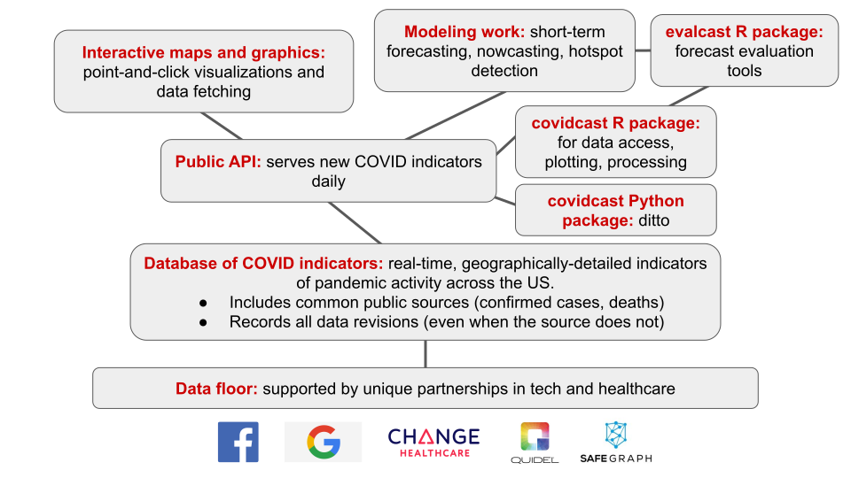
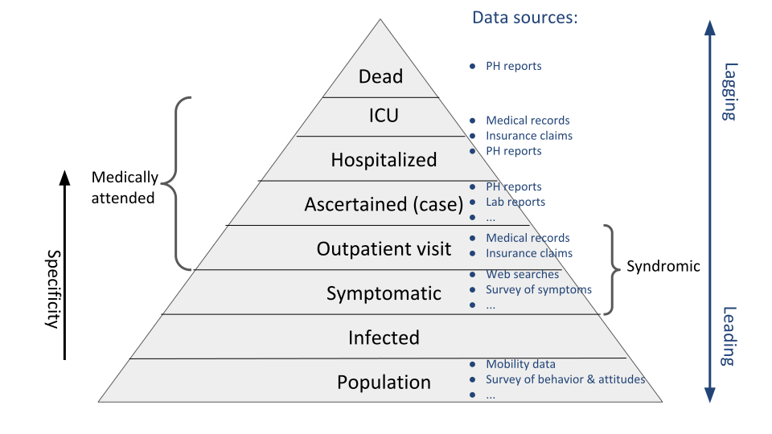

```{r, include = FALSE}
knitr::opts_chunk$set(message=FALSE, warning=FALSE, cache=TRUE, autodep=TRUE, 
                      cache.comments=TRUE)
library(dplyr)
library(purrr)
library(tidyr)
library(ggplot2)
library(gridExtra)

col = function(x, color = "#bb0000") {
  sprintf("<span style='color: %s;'>%s</span>", color, x)
}
```

# Delphi Then

- In 2012, we formed [Delphi](https://delphi.cmu.edu) to "develop the theory and practice of epidemic forecasting, and its role in decision-making"
- Led by Roni Rosenfeld and Ryan Tibshirani, with several participating faculty and graduate students 
- Participated in annual CDC flu forecasting challenges starting in 2013, earned top place in several 
- Awarded `r col("CDC Center of Excellence")` for flu forecasting in 2019 
- Published open code and data, including numerous influenza surveillance streams 

# Delphi Now

- We've gone from 7 members to over 40, to support the COVID-19 response
- Added many smart folks from CMU, but also Stanford, UC Davis, USC, Google
- Beyond (before?) forecasting: we've been focusing, now more than ever, on `r col("data")`
- *This problem is so hard that our best weapon is a diversity of data sources*

# COVIDcast Ecosystem



# This Talk

I can't cover all of this! I'll focus on our data sources, our API, and some `r col("basic demos")` ("real" modeling work will have to be for a future talk ...)

Outline:

1. Data sources
2. API and client support
3. Dive into symptom surveys

`r col("Reproducible talk:")` all code included

# `r col("Part 1: Data Sources", "white")` {.bigger} 

<div style='text-align: center; padding: 225px 0px'> 
***Part 1: Data Sources*** </div>

# Severity Pyramid



# What Is This Used For?

- Forecasting, e.g.,
    * Case incidence: for vaccine trial site selection
    * Hospitalizations: for planning and preparedness 
- Nowcasting, e.g.,
    * Situational awareness: testing and resource allocation
    * Decision-making: re-opening criteria, school closures
 - General epidemiological research, e.g.,
    * What behaviors are linked to spread?
    * What symptoms are linked to cases?

# COVIDcast Indicators


# COVIDcast Indicators (Cont.)

- Available through the [COVIDcast API](https://cmu-delphi.github.io/delphi-epidata/api/covidcast.html), updated daily
- Most (nearly all) available at the `r col("county level")`
- For a full list see our [signal documentation site](https://cmu-delphi.github.io/delphi-epidata/api/covidcast_signals.html) 
- See also our [R](https://cmu-delphi.github.io/covidcast/covidcastR/) and [Python](https://cmu-delphi.github.io/covidcast/covidcast-py/html/) packages

# Example: Deaths

How many people have died from COVID-19 per day, in my state, since March 1?

```{r, fig.width=8, fig.height=6}
library(covidcast)
start_day = "2020-03-01"
end_day = "2020-10-28"
deaths = covidcast_signal(data_source = "usa-facts", 
                          signal = "deaths_7dav_incidence_num", 
                          start_day = start_day, end_day = end_day,
                          geo_type = "state", geo_values = "pa")

plot(deaths, plot_type = "line", 
     title = "New COVID-19 deaths in PA (7-day average)")
```

# Example: Hospitalizations

What percentage of daily hospital admissions are due to COVID-19 in PA, NY, TX?

```{r, fig.width=8, fig.height=6}
hosp = covidcast_signal(data_source = "hospital-admissions", 
                        signal = "smoothed_adj_covid19",
                        start_day = start_day, end_day = end_day,
                        geo_type = "state", geo_values = c("pa", "ny", "tx"))

plot(hosp, plot_type = "line", 
     title = "% of hospital admissions due to COVID-19")
```

# Example: Cases 

What does the current COVID-19 incident case rate look like, nationwide?

```{r, fig.width=9, fig.height=7}
cases = covidcast_signal(data_source = "usa-facts", 
                         signal = "confirmed_7dav_incidence_prop",
                         start_day = end_day, end_day = end_day)

plot(cases, title = "New COVID-19 cases per 100,000 people")
```

# Example: Cases (Cont.)

What does the current COVID-19 cumulative case rate look like, nationwide?

```{r, fig.width=9, fig.height=7}
cases = covidcast_signal(data_source = "usa-facts", 
                         signal = "confirmed_cumulative_prop",
                         start_day = end_day, end_day = end_day)

plot(cases, title = "Cumulative COVID-19 cases per 100,000 people", 
     choro_params = list(legend_n = 6))
```

# Example: Cases (Cont.)

Where is the current COVID-19 cumulative case rate greater than 2%?

```{r, fig.width=9, fig.height=7}
plot(cases, choro_col = c("#D3D3D3", "#FFC0CB"), 
     title = "Cumulative COVID-19 cases per 100,000 people",
     choro_params = list(breaks = c(0, 2000), legend_width = 3))
```

# Example: Doctor's Visits

How do some cities compare in terms of doctor's visits due to COVID-like illness?

```{r, fig.width=8, fig.height=6}
dv = covidcast_signal(data_source = "doctor-visits", 
                      signal = "smoothed_adj_cli", 
                      start_day = start_day, end_day = end_day,
                      geo_type = "msa", 
                      geo_values = name_to_cbsa(c("Pittsburgh", "New York", 
                                                  "San Antonio", "Miami")))

plot(dv, plot_type = "line", 
     title = "% of doctor's visits due to COVID-like illness")
```

# Example: Symptoms

How do my county and my friend's county compare in terms of COVID symptoms?

```{r, fig.width=8, fig.height=6}
sympt = covidcast_signal(data_source = "fb-survey", 
                         signal = "smoothed_hh_cmnty_cli",
                         start_day = "2020-04-15", end_day = end_day,
                         geo_values = c(name_to_fips("Allegheny"),
                                        name_to_fips("Fulton", state = "GA")))

plot(sympt, plot_type = "line", range = range(sympt$value),
     title = "% of people who know somebody with COVID symptoms")
```

# `r col("Part 2: API and Client Support", "white")` {.bigger} 

<div style='text-align: center; padding: 225px 0px'> 
***Part 2: API and Client Support*** </div>

# COVIDcast API 

The COVIDcast API is based on HTTP GET queries and returns data in JSON form. The base URL is https://api.covidcast.cmu.edu/epidata/api.php?source=covidcast 

<br>

| Parameter | Description | Examples |
| :-- | :-- | :-- |
| `data_source` | data source | `doctor-visits` or `fb-survey` |
| `signal` | signal derived from data source | `smoothed_cli` or `smoothed_adj_cli` |
| `time_type` | temporal resolution of the signal | `day` or `week` |
| `geo_type` | spatial resolution of the signal | `county`, `hrr`, `msa`, or `state` |
| `time_values` | time units over which events happened | `20200406` or `20200406-20200410` |
| `geo_value` | location codes, depending on `geo_type` | `*` for all, or `pa` for Pennsylvania |

# Example: API Query

Estimated % COVID-like illness on April 6, 2020 from the Facebook survey, in Allegheny County: https://api.covidcast.cmu.edu/epidata/api.php?source=covidcast&data_source=fb-survey&signal=raw_cli&time_type=day&geo_type=county&time_values=20200406&geo_value=42003 

```{r}
library(jsonlite)
res = readLines("https://api.covidcast.cmu.edu/epidata/api.php?source=covidcast&data_source=fb-survey&signal=raw_cli&time_type=day&geo_type=county&time_values=20200406&geo_value=42003")
prettify(res)
```

# API Documentation

For full details, see the [API documentation site](https://cmu-delphi.github.io/delphi-epidata/api/covidcast.html). There you'll also find details on:

- [Data sources and signals](https://cmu-delphi.github.io/delphi-epidata/api/covidcast_signals.html) 
- [Geographic coding](https://cmu-delphi.github.io/delphi-epidata/api/covidcast_geography.html)
- [COVIDcast metadata](https://cmu-delphi.github.io/delphi-epidata/api/covidcast_meta.html)

# As Of, Issues, Lag

By default the API returns the most recent data for each `time_value`. We also provide access to all previous versions of the data, using the following optional parameters:

<br>

| Parameter | To get data ... | Examples |
| :-- | :-- | :-- |
| `as_of` | as if we queried the API on a particular date | `20200406` |
| `issues` | published at a particular date or date range | `20200406` or `20200406-20200410` |
| `lag` | published a certain number of time units after events occured | `1` or `3` |

# Data Revisions 

Why would we need this? Because many data sources are subject to `r col("revisions:")`

- Case and death counts frequently corrected/adjusted by authorities
- Medical claims data can take weeks to be submitted and/or processed
- Testing/lab data can be backlogged for a variety of reasons, etc.

This presents a challenge to modelers: e.g., we have to learn how to forecast based on the `r col("data we'd have at the time")`, not updates that would arrive later

To accommodate, we log revisions even when the original data source does not!

# covidcast R Package

We also provide an R package called [covidcast](https://cmu-delphi.github.io/covidcast/covidcastR/) for API access. Highlights: 

- Easy API querying:
    * Same specification structure (many default parameters) 
    * Full support for data revisions (as of, issues, lag)
- Plotting functionality:
    * Choropleth maps (customizable: colors scales, etc.)
    * Bubble maps (customizable: size scales, etc.)
    * Time series plots (pretty basic, just add ggplot layers)
- Basic signal processing:
    * Correlations sliced by location, or by time
    * Data wrangling: preparing signals for analysis

(Have an idea? File an issue or contribute a PR on our [public GitHub repo](https://github.com/cmu-delphi/covidcast))

# Example: Backfill in Doctor's Visits

The last two weeks of August in CA ...

```{r, fig.width=8, fig.height=5}
# Let's get the data that was available as of 09/22, for the end of August in CA
dv = covidcast_signal(data_source = "doctor-visits", 
                      signal = "smoothed_adj_cli",
                      start_day = "2020-08-15", end_day = "2020-08-31",
                      geo_type = "state", geo_values = "ca",
                      as_of = "2020-09-21")

# Plot the time series curve
xlim = c(as.Date("2020-08-15"), as.Date("2020-09-21"))
ylim = c(3.83, 5.92)
ggplot(dv, aes(x = time_value, y = value)) + 
  geom_line() +
  coord_cartesian(xlim = xlim, ylim = ylim) +
  geom_vline(aes(xintercept = as.Date("2020-09-21")), lty = 2) +
  labs(color = "as of", x = "Date", y = "% doctor's visits due to CLI in CA") +
  theme_bw() + theme(legend.pos = "bottom")
```

# Example: Backfill in Doctor's Visits (Cont.)

The last two weeks of August in CA ...

```{r, fig.width=8, fig.height=5}
# Now loop over a bunhch of "as of" dates, fetch data from the API for each one
as_ofs = seq(as.Date("2020-09-01"), as.Date("2020-09-21"), by = "week")
dv_as_of = map_dfr(as_ofs, function(as_of) {
  covidcast_signal(data_source = "doctor-visits", signal = "smoothed_adj_cli",
                   start_day = "2020-08-15", end_day = "2020-08-31", 
                   geo_type = "state", geo_values = "ca", as_of = as_of)
})

# Plot the time series curve "as of" September 1
dv_as_of %>% 
  filter(issue == as.Date("2020-09-01")) %>% 
  ggplot(aes(x = time_value, y = value)) + 
  geom_line(aes(color = factor(issue))) + 
  geom_vline(aes(color = factor(issue), xintercept = issue), lty = 2) +
  coord_cartesian(xlim = xlim, ylim = ylim) +
  labs(color = "as of", x = "Date", y = "% doctor's visits due to CLI in CA") +
  geom_line(data = dv, aes(x = time_value, y = value)) +
  geom_vline(aes(xintercept = as.Date("2020-09-21")), lty = 2) +
  theme_bw() + theme(legend.pos = "none")
```

# Example: Backfill in Doctor's Visits (Cont.)

The last two weeks of August in CA ...

```{r, fig.width=8, fig.height=5}
dv_as_of %>% 
  ggplot(aes(x = time_value, y = value)) + 
  geom_line(aes(color = factor(issue))) + 
  geom_vline(aes(color = factor(issue), xintercept = issue), lty = 2) +
  coord_cartesian(xlim = xlim, ylim = ylim) +
  labs(color = "as of", x = "Date", y = "% doctor's visits due to CLI in CA") +
  geom_line(data = dv, aes(x = time_value, y = value)) +
  geom_vline(aes(xintercept = as.Date("2020-09-21")), lty = 2) +
  theme_bw() + theme(legend.pos = "none")
```

# `r col("Part 3: Dive Into Symptom Surveys", "white")` {.bigger} 

<div style='text-align: center; padding: 225px 0px'> 
***Part 3: Dive Into Symptom Surveys*** </div>

# Massive Symptom Survey

Through recruitment partnership with Facebook, we survey about `r col("75,000 people daily")` (and over 10 million since it began in April), in the United States about:

- COVID symptoms (common and rare)
- COVID testing
- Mental health
- Social contacts and behavior
- Demographics

A [parallel, international effort](https://covidmap.umd.edu/) by the University of Maryland reaches 100+ countries in 55 languages; over 20 million responses so far

# Massive Symptom Survey (Cont.)

- The survey is implemented on Qualtrics, managed by CMU
- Facebook never receives any individual responses
- Designed to take about 10 minutes; about 35 questions
- Questions selected for relevance to forecasting and nowcasting
- But also for research in public health (understanding the pandemic burden)
- Respondents provide ZIP code, so data is available at county level

This is the largest non-Census research survey `r col("ever conducted")` (that we know of)

# COVID-Like Illness

Using the survey data we generate daily, county-level estimates of:

- `r col("% CLI:")` the percentage of people with COVID-like illness
- `r col("% CLI-in-community:")` the percentage of people who know someone in their local community with COVID-like illness

(Note that COVID-like illness or CLI is defined as *fever of at least 100 °F, along with cough, shortness of breath, or difficulty breathing*. We also ask people to report on more rare symptoms)

# Why % CLI-in-Community? 

Why ask a proxy question (have people report on others)? Here's Spearman correlations to COVID-19 case rates sliced by time: 

```{r, fig.width=7, fig.height=5}
# Fetch Facebook % CLI signal, % CLI-in-community signal and confirmed case
# incidence proportions
start_day = "2020-04-15"
end_day = "2020-10-28"
sympt1 = covidcast_signal("fb-survey", "smoothed_cli", 
                          start_day, end_day)
sympt2 = covidcast_signal("fb-survey", "smoothed_hh_cmnty_cli", 
                          start_day, end_day)
cases = covidcast_signal("usa-facts", "confirmed_7dav_incidence_prop", 
                         start_day, end_day)

# Consider only counties with at least 500 cumulative cases so far
case_num = 500
geo_values = covidcast_signal("usa-facts", "confirmed_cumulative_num",
                              max(cases$time), max(cases$time)) %>%
  filter(value >= case_num) %>% pull(geo_value)
sympt1_act = sympt1 %>% filter(geo_value %in% geo_values)
sympt2_act = sympt2 %>% filter(geo_value %in% geo_values)
cases_act = cases %>% filter(geo_value %in% geo_values)

# Compute correlations, per time, over all counties
df_cor1 = covidcast_cor(sympt1_act, cases_act, by = "time_value", 
                        method = "spearman")
df_cor2 = covidcast_cor(sympt2_act, cases_act, by = "time_value", 
                        method = "spearman")

# Stack rowwise into one data frame
df_cor = rbind(df_cor1, df_cor2)
df_cor$signal = c(rep("% CLI", nrow(df_cor1)), 
                  rep("% CLI-in-community", nrow(df_cor2)))

# Then plot correlations over time 
ggplot_colors = c("#FC4E07", "#00AFBB", "#E7B800")
ggplot(df_cor, aes(x = time_value, y = value)) + 
  geom_line(aes(color = signal)) +
  scale_color_manual(values = ggplot_colors[c(3,1)]) +
  labs(title = "Correlation between survey signals and case rates (by time)",
       subtitle = sprintf("Over all counties with at least %i cumulative cases",
                          case_num), x = "Date", y = "Correlation") +
    theme_bw() + theme(legend.pos = "bottom", legend.title = element_blank())
```

# Why % CLI-in-Community? (Cont.)

Now here's Spearman correlations to COVID-19 case rates sliced by county: 

```{r, fig.width=7, fig.height=5}
# Compute correlations, per time, over all counties
df_cor1 = covidcast_cor(sympt1_act, cases_act, by = "geo_value", 
                        method = "spearman")
df_cor2 = covidcast_cor(sympt2_act, cases_act, by = "geo_value", 
                        method = "spearman")

# Stack rowwise into one data frame
df_cor = rbind(df_cor1, df_cor2)
df_cor$signal = c(rep("% CLI", nrow(df_cor1)), 
                  rep("% CLI-in-community", nrow(df_cor2)))

# Then plot correlations as densities
ggplot(df_cor, aes(value)) + geom_density(aes(color = signal, fill = signal), 
                                          alpha = 0.4) +
  scale_color_manual(values = ggplot_colors[c(3,1)]) +
  scale_fill_manual(values = ggplot_colors[c(3,1)]) +
  labs(title = "Correlation between survey signals and case rates (by county)",
       subtitle = sprintf("Over all counties with at least %i cumulative cases",
                          case_num), x = "Date", y = "Correlation") +
    theme_bw() + theme(legend.pos = "bottom", legend.title = element_blank())
```

# An Early Indicator?

Let's take a look at case counts in Miami-Dade, from June 1 to July 15, and compare it to the % CLI-in-community indicator based on our survey: 

```{r, fig.width=7, fig.height=5}
# Fetch Facebook % CLI-in-community signal and confirmed case incidence numbers
# from June 1 to July 15
start_day = "2020-06-01"
end_day = "2020-07-15"
sympt = covidcast_signal("fb-survey", "smoothed_hh_cmnty_cli", 
                         start_day, end_day)
cases = covidcast_signal("usa-facts", "confirmed_7dav_incidence_num",
                         start_day, end_day)

# Function to transform from one range to another
trans = function(x, from_range, to_range) {
  (x - from_range[1]) / (from_range[2] - from_range[1]) *
    (to_range[2] - to_range[1]) + to_range[1]
}

# Function to produce a plot comparing the signals for one county
plot_one = function(geo_value, title = NULL, xlab = NULL,
                    ylab1 = NULL, ylab2 = NULL, legend =  TRUE) {
  # Filter down the signal data frames
  given_geo_value = geo_value
  sympt_one = sympt %>% filter(geo_value == given_geo_value)
  cases_one = cases %>% filter(geo_value == given_geo_value)
  
  # Compute ranges of the two signals
  range1 = cases_one %>% select("value") %>% range
  range2 = sympt_one %>% select("value") %>% range
  
  # Convenience functions for our two signal ranges
  trans12 = function(x) trans(x, range1, range2)
  trans21 = function(x) trans(x, range2, range1)

  # Find state name, find abbreviation, then set title
  state_name = fips_to_name(paste0(substr(geo_value, 1, 2), "000"))
  state_abbr = name_to_abbr(state_name)
  title = paste0(fips_to_name(geo_value), ", ", state_abbr)

  # Transform the combined signal to the incidence range, then stack
  # these rowwise into one data frame
  df = select(rbind(sympt_one %>% mutate_at("value", trans21),
                    cases_one), c("time_value", "value"))
  df$signal = c(rep("% CLI-in-community", nrow(sympt_one)),
                rep("New COVID-19 cases", nrow(cases_one)))
  
  # Finally, plot both signals
  pos = ifelse(legend, "bottom", "none")
  return(ggplot(df, aes(x = time_value, y = value)) +
           geom_line(aes(color = signal)) +
           scale_color_manual(values = ggplot_colors[1:2]) +
           scale_y_continuous(name = ylab1, limits = range1,
                              sec.axis = sec_axis(trans = trans12,
                                                  name = ylab2)) +
           labs(title = title, x = xlab) + theme_bw() +
           theme(legend.pos = pos, legend.title = element_blank()))
}

# Produce a plot for Miami-Dade, and add vertical lines
plot_one(name_to_fips("Miami-Dade"), xlab = "Date",
         ylab1 = "New COVID-19 cases",
         ylab2 = "% of people who know someone with CLI") +
  geom_vline(xintercept = as.numeric(as.Date("2020-06-19")),
             linetype = 2, size = 1, color = ggplot_colors[1]) +
  geom_vline(xintercept = as.numeric(as.Date("2020-06-25")),
             linetype = 2, size = 1, color = ggplot_colors[2])
```

# An Early Indicator? (Cont.) 

Ok, that was just one county... let's look at the top 20 in terms of the rise in case counts:

```{r, fig.width=10, fig.height=10}
num = 20
geo_values = cases %>% group_by(geo_value) %>%
  summarize(diff = last(value) - first(value)) %>%
  arrange(desc(diff)) %>% head(num) %>% pull(geo_value)

p_list = vector("list", num)
for (i in 1:num) {
  p_list[[i]] = plot_one(geo_values[i], legend = FALSE)
}
do.call(grid.arrange, c(p_list, nrow = 5, ncol = 4))
```

# Simple Forecasting Demo

Notational setup: for location (county) $\ell$ and time (day) $t$, let

- $Y_{\ell,t}$ denote the COVID-19 case incidence rate,
- $F_{\ell,t}$ the Facebook % CLI-in-community signal.

To predict case rates $d$ days ahead, consider two simple models:
$$
\begin{align*}
& h(Y_{\ell,t+d}) \approx \alpha + \sum_{j=0}^2 \beta_j h(Y_{\ell,t-7j}) 
\quad \text{(Cases)} \\
& h(Y_{\ell,t+d}) \approx \alpha + \sum_{j=0}^2 \beta_j h(Y_{\ell,t-7j}) +
\sum_{j=0}^2 \gamma_j h(F_{\ell,t-7j}) 
\quad \text{(Cases + Facebook)} \\
\end{align*}
$$

For each forecast date, we train models on the most recent 14 days worth of data

# Simple Forecasting Demo (Cont.)

Results from forecasts made over early May to late August (for details, read [this blog post](https://delphi.cmu.edu/blog/2020/09/21/can-symptoms-surveys-improve-covid-19-forecasts/)):

```{r, fig.width=7, fig.height=5}
# This RData file was downloaded from  https://github.com/cmu-delphi/delphi-blog/tree/main/content/post/forecast-demo;
# the code for generating this RData file is also there
load("demo-extended.rda")

# Compute and plot median errors as function of number of days ahead
err_by_lead = res %>%
  select(-c(err3, err4)) %>%
  drop_na() %>%                                       # Restrict to common time
  mutate(err1 = err1 / err0, err2 = err2 / err0) %>%  # Compute relative error
                                                      # to strawman model
  ungroup() %>%
  select(-err0) %>%
  pivot_longer(names_to = "model", values_to = "err",
               cols = -c(geo_value, time_value, lead)) %>%
  mutate(model = factor(model, labels = c("Cases", "Cases + Facebook"))) %>%
  group_by(model, lead) %>%
  summarize(err = median(err)) %>% 
  ungroup()

ggplot(err_by_lead, aes(x = lead, y = err)) + 
  geom_line(aes(color = model)) + 
  geom_point(aes(color = model)) + 
  geom_hline(yintercept = err_by_lead %>% 
               filter(lead %in% 7, model == "Cases") %>% pull(err),
             linetype = 2, color = "gray") +
  scale_color_manual(values = c("black", ggplot_colors[1])) +
  labs(title = "Forecasting errors by number of days ahead",
       subtitle = sprintf("Over all counties with at least %i cumulative cases",
                          case_num),
       x = "Number of days ahead", y = "Median scaled error") +
  theme_bw() + theme(legend.pos = "bottom", legend.title = element_blank())
```

# Latest Data Streams

Latest revision of the survey allows us to calculate new aggregates:

- Test positivity rate, broken down by test reason
- Percentage of population tested in last 14 days, broken down by age, occupation
- Percentage of people *ever* tested
- Types of activities people do outside their homes
- Mask wearing
- Anxiety, depression, isolation

# Mask Wearing

What did mask wearing look like as of mid-October? And how does it compare to 
% CLI-in-community?

```{r, fig.width=9, fig.height=4.5}
day = "2020-10-15"
mask = covidcast_signal("fb-survey", "smoothed_wwearing_mask",
                        start_day = day, end_day = day, geo_type = "state")
sympt = covidcast_signal("fb-survey", "smoothed_whh_cmnty_cli",
                         start_day = day, end_day = day, geo_type = "state")

p1 = plot(mask, title = "% wearing masks in public most or all the time",
          range = c(55, 100), choro_col = c("#D9F0C2", "#BFE6B5", "#1F589F")) 
p2 = plot(sympt, title = "% who know someone who is sick", range = c(5, 40)) 
grid.arrange(p1, p2, nrow = 1)
```

# Mask Wearing (Cont.)

Another look ...

```{r, fig.width=7, fig.height=5}
joined_data = inner_join(mask, sympt, by = "geo_value", 
                          suffix = c(".mask", ".cli"))
ggplot(joined_data, aes(x = value.mask, y = value.cli, 
                        label = toupper(geo_value))) +
  geom_text(size = 4, check_overlap = TRUE) +
  geom_smooth(method = "lm", se = FALSE, col = ggplot_colors[1]) +
  labs(x = "% wearing masks most/all the time in public",
       y = "New COVID-19 cases per 100,000 people",
       title = "Current COVID case rates and mask usage, by state") +
  theme_bw()
```

# Wrapping Up

Delphi's COVIDcast ecosystem has many parts:

1. Unique relationships with partners in tech and healthcare granting us access to data on pandemic activity
2. Code and infrastructure to build `r col("COVID-19 indicators")`, continuously-updated and geographically-comprehensive
3. A historical database of all indicators, including `r col("revision tracking")`
4. A [public API](https://cmu-delphi.github.io/delphi-epidata/api/covidcast.html) (and [R and Python packages](https://cmu-delphi.github.io/delphi-epidata/api/covidcast_clients.html)) serving new indicators daily 
5. [Interactive maps and graphics](https://covidcast.cmu.edu) to display our indicators
6. `r col("Forecasting and modeling")` work building on the indicators

In this pandemic, it'll take an entire community to find answers to all the important questions. Please join ours!

# Thanks

- The [whole Delphi team](https://covidcast.cmu.edu/covid19-response-team.html), and various CMU units
- Google, Facebook, and Amazon Web Services
- SafeGraph, Quidel, Qualtrics, Change Healthcare
- Centers for Disease Control and Prevention

<br>

 

# `r col("Appendix", "white")` {.bigger} 

<div style='text-align: center; padding: 225px 0px'> 
***Appendix*** </div>

# Some Links

- [API documentation](https://cmu-delphi.github.io/delphi-epidata/api/covidcast.html) 
- Client access: [R](https://cmu-delphi.github.io/covidcast/covidcastR/) and [Python](https://cmu-delphi.github.io/covidcast/covidcast-py/html/) 
- [Signal documentation](https://cmu-delphi.github.io/delphi-epidata/api/covidcast_signals.html) 
- [Survey documentation](https://cmu-delphi.github.io/delphi-epidata/symptom-survey/)
- [Interactive graphics](https://covidcast.cmu.edu)
- [Delphi's blog](https://delphi.cmu.edu/blog/)
- [Delphi's GitHub org](https://www.github.com/cmu-delphi/)

# Current Metadata

```{r}
meta = covidcast_meta()
summary(meta)
```

# Access to Survey Microdata

Want to study a problem that can be answered with 10 million US survey responses since April? Possible topics:

- Symptoms reported by people testing positive, stratified by chronic conditions, age, etc.
- Test rates and availability by employment and occupation
- Mental health impacts of interventions
- Disparate impacts on minorities and disadvantaged groups
- ... anything else you can think of

Raw response data is freely available to researchers who sign a [data use agreement](https://dataforgood.fb.com/docs/covid-19-symptom-survey-request-for-data-access/) to protect confidentiality of responses

We're `r col("building a network")` of academic and non-profit researchers to learn from the survey. Join us!