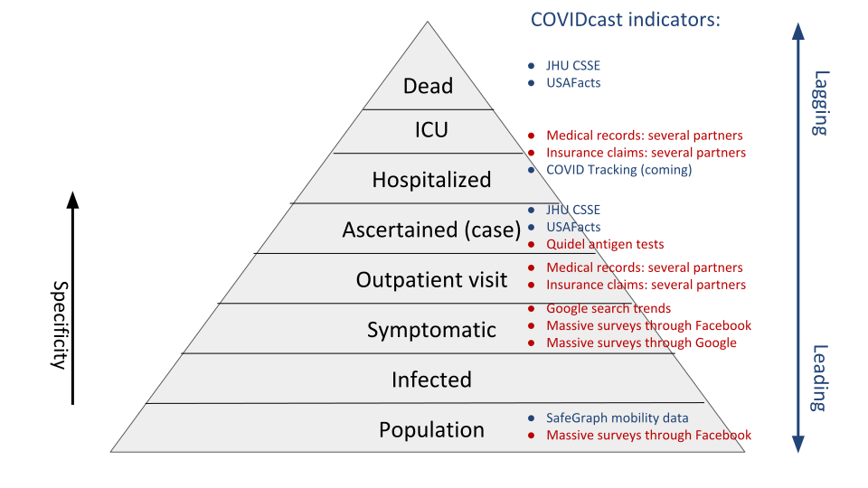

```{r, include = FALSE, message=FALSE, warning=FALSE}
knitr::opts_chunk$set(message=FALSE, warning=FALSE, 
                      cache=TRUE, autodep=TRUE,
                      cache.comments=TRUE, fig.align = "center")
library(tidyverse)
library(lubridate)
library(ggplot2)
library(gridExtra)
library(cowplot)
library(knitr)

col = function(x, color = "#bb0000") {
  sprintf("<span style='color: %s;'>%s</span>", color, x)
}
```

# What is Delphi

- Formed in 2012, [Delphi](https://delphi.cmu.edu) to "develop the theory and practice of epidemic forecasting, and its role in decision-making"
- Led by Profs. Roni Rosenfeld and Ryan Tibshirani at CMU
- Participated in annual CDC flu forecasting challenges starting in 2013, earned top place in several 
- Awarded `r col("CDC Center of Excellence")` for flu forecasting in 2019
- Currently, over 40 members to support the COVID-19 response
- Researchers from CMU, Stanford, UC Davis, USC, UBC. Google.org Fellows.
- Beyond (before?) forecasting: we've been focusing on `r col("data")`
- *This problem is so hard that our best weapon is a diversity of data sources*

# COVIDcast Ecosystem


# This Talk

I can't cover all of this! I'll focus on `r col("forecasting philosophy and evaluation")`

Outline:

1. Data sources and API
2. Data preparation and quality
3. Making and evaluating forecasts

`r col("Implemented with", "white")`

`r col("Reproducible talk:", "white")`


# This Talk

I can't cover all of this! I'll focus on `r col("forecasting philosophy and evaluation")`

Outline:

1. Data sources and API
2. `r col("Data preparation and quality")`
3. `r col("Making and evaluating forecasts")`

Implemented with `{evalcast}` package + API

`r col("Reproducible talk:")` all code included


# `r col("Part 1: Data Sources", "white")` {.bigger} 

<h1><div style='text-align: center; padding: 225px 0px'> 
**1 Data Sources and API** </div></h1>

# Severity Pyramid


# What Is This Used For?

- Forecasting, e.g.,
    * Case incidence: for vaccine trial site selection
    * Hospitalizations: for planning and preparedness 
- Nowcasting, e.g.,
    * Situational awareness: testing and resource allocation
    * Decision-making: re-opening criteria, school closures
- General epidemiological research, e.g.,
    * What behaviors are linked to spread?
    * What symptoms are linked to cases?

# COVIDcast Indicators



# COVIDcast Indicators (Cont.)

- Available through the [COVIDcast API](https://cmu-delphi.github.io/delphi-epidata/api/covidcast.html), updated daily
- Most (nearly all) available at the `r col("county level")`
- For a full list see our [signal documentation site](https://cmu-delphi.github.io/delphi-epidata/api/covidcast_signals.html) 
- See also our [R](https://cmu-delphi.github.io/covidcast/covidcastR/) and [Python](https://cmu-delphi.github.io/covidcast/covidcast-py/html/) packages

# Example: Deaths

How many people have died from COVID-19 per day, in my state, since March 1?

```{r, fig.width=8, fig.height=6}
library(covidcast)
deaths = covidcast_signal(data_source = "usa-facts", 
                          signal = "deaths_7dav_incidence_num", 
                          start_day = "2020-03-01", 
                          end_day = "2020-10-15",
                          geo_type = "state", geo_values = "in")

plot(deaths, plot_type = "line", 
     title = "COVID-19 deaths in IN (7-day trailing average)")
```

# Example: Hospitalizations

What percentage of daily hospital admissions are due to COVID-19 in IN, NY, TX, CA?

```{r, fig.width=8, fig.height=6}
hosp = covidcast_signal(data_source = "hospital-admissions", 
                        signal = "smoothed_adj_covid19",
                        start_day = "2020-03-01", end_day = "2020-10-15",
                        geo_type = "state", 
                        geo_values = c("in", "ny", "tx", "ca"))

plot(hosp, plot_type = "line", 
     title = "% of hospital admissions due to COVID-19")
```

# Example: Cases 

What does the current COVID-19 incident case rate look like, nationwide?

```{r, fig.width=9, fig.height=5}
cases = covidcast_signal(data_source = "usa-facts", 
                         signal = "confirmed_7dav_incidence_prop",
                         start_day = "2020-10-21", end_day = "2020-10-21")

plot(cases) + 
  ggtitle("Daily new COVID-19 cases per 100,000 people",
          subtitle = "Average for week ending 21 October")
```


# Example: Symptoms

How does mask behavior relate to symptoms?

```{r, fig.width=7, fig.height=5}
masks = covidcast_signal(data_source = "fb-survey", 
                         signal = "smoothed_wearing_mask",
                         start_day = "2020-10-15", end_day = "2020-10-15",
                         geo_type="state") %>%
  select(geo_value, value) %>% rename(masks=value)
cli = covidcast_signal(data_source = "fb-survey", 
                       signal = "smoothed_hh_cmnty_cli",
                         start_day = "2020-10-15", end_day = "2020-10-15",
                         geo_type="state") %>%
  select(geo_value, value) %>% rename(cli=value)
full_join(masks, cli) %>%
  ggplot(aes(masks, cli)) + geom_text(aes(label=geo_value), color="#bb0000") +
  theme_bw() + xlab("% wearing masks") + ylab("% COVID-like illness") +
  ggtitle("Average for week ending 15 October")
```

# `r col("Forecasting", "white")` {.bigger} 

<h1><div style='text-align: center; padding: 225px 0px'> 
**2 Data preparation and quality** </div></h1>


# As Of, Issues, Lag

By default the API returns the most recent data for each `time_value`. 

We also provide access to all previous versions of the data:

<br>

| Parameter | To get data ... | Examples |
| :-- | :-- | :-- |
| `as_of` | as if we queried the API on a particular date | `20200406` |
| `issues` | published at a particular date or date range | `20200406` or `20200406-20200410` |
| `lag` | published a certain number of time units after events occured | `1` or `3` |

# Data Revisions 

Why would we need this? Because many data sources are subject to `r col("revisions:")`

- Case and death counts frequently corrected/adjusted by authorities
- Medical claims data can take weeks to be submitted and/or processed
- Testing/lab data can be backlogged for a variety of reasons, etc.

This presents a challenge to modelers: e.g., we have to learn how to forecast based on the `r col("data we'd have at the time")`, not updates that would arrive later

To accommodate, we log revisions even when the original data source does not!


# Example: Backfill in Doctor's Visits

The last two weeks of August in CA ...

```{r, fig.width=8, fig.height=5}
# Let's get the data that was available as of 09/22, for the end of August in CA
dv = covidcast_signal(data_source = "doctor-visits", 
                      signal = "smoothed_adj_cli",
                      start_day = "2020-08-15", end_day = "2020-08-31",
                      geo_type = "state", geo_values = "ca",
                      as_of = "2020-09-21")

# Plot the time series curve
xlim = c(as.Date("2020-08-15"), as.Date("2020-09-21"))
ylim = c(3.83, 5.92)
ggplot(dv, aes(x = time_value, y = value)) + 
  geom_line() +
  coord_cartesian(xlim = xlim, ylim = ylim) +
  geom_vline(aes(xintercept = as.Date("2020-09-21")), lty = 2) +
  labs(color = "as of", x = "Date", y = "% doctor's visits due to CLI in CA") +
  theme_bw() + theme(legend.pos = "bottom")
```

# Example: Backfill in Doctor's Visits

The last two weeks of August in CA ...

```{r, fig.width=8, fig.height=5}
# Now loop over a bunhch of "as of" dates, fetch data from the API for each one
as_ofs = seq(as.Date("2020-09-01"), as.Date("2020-09-21"), by = "week")
dv_as_of = map_dfr(as_ofs, function(as_of) {
  covidcast_signal(data_source = "doctor-visits", signal = "smoothed_adj_cli",
                   start_day = "2020-08-15", end_day = "2020-08-31", 
                   geo_type = "state", geo_values = "ca", as_of = as_of)
})

# Plot the time series curve "as of" September 1
dv_as_of %>% 
  filter(issue == as.Date("2020-09-01")) %>% 
  ggplot(aes(x = time_value, y = value)) + 
  geom_line(aes(color = factor(issue))) + 
  geom_vline(aes(color = factor(issue), xintercept = issue), lty = 2) +
  coord_cartesian(xlim = xlim, ylim = ylim) +
  labs(color = "as of", x = "Date", y = "% doctor's visits due to CLI in CA") +
  geom_line(data = dv, aes(x = time_value, y = value)) +
  geom_vline(aes(xintercept = as.Date("2020-09-21")), lty = 2) +
  theme_bw() + theme(legend.pos = "none")
```


# Example: Backfill in Doctor's Visits

The last two weeks of August in CA ...

```{r, fig.width=8, fig.height=5}
dv_as_of %>% 
  ggplot(aes(x = time_value, y = value)) + 
  geom_line(aes(color = factor(issue))) + 
  geom_vline(aes(color = factor(issue), xintercept = issue), lty = 2) +
  coord_cartesian(xlim = xlim, ylim = ylim) +
  labs(color = "as of", x = "Date", y = "% doctor's visits due to CLI in CA") +
  geom_line(data = dv, aes(x = time_value, y = value)) +
  geom_vline(aes(xintercept = as.Date("2020-09-21")), lty = 2) +
  theme_bw() + theme(legend.pos = "none")
```

# Implications for Forecasting and Evaluation

1. In backtesting, we should provide the forecaster the data that `r col("would have been available")` as of the forecast date. Otherwise, performance assessment may be naively optimistic.

2. Trained forecasters that do not account for backfill may learn to rely too heavily on recent data.

3. Evaluation relies on the "actual outcome", but this might not be reliably known until some time has passed.

Note: `evalcast` has a `backfill_buffer` parameter that forces one to wait a certain amount of time before trying to evaluate.

# Making corrections

Some data has other obvious issues ...

```{r}
riga = suppressMessages(covidcast_signal(
  "usa-facts","deaths_incidence_num",geo_type = "state",
  geo_values = c("ri","ga")))
plot(filter(riga, geo_value=="ga"), 
     plot_type="line", title="usa-facts: deaths_incidence_num --- GA")
```

# Making corrections

Some data has other obvious issues ...

```{r}
plot(filter(riga, geo_value=="ri"), 
     plot_type="line", title="usa-facts: deaths_incidence_num --- RI")
```

# Making corrections

```{r}
source("correct-riga.R") # available in the Github repo, 
                         # removed due to length
riga %>% filter(time_value > ymd("2020-04-01")) %>%
  dplyr::select(geo_value, time_value, value, corrected, flag) %>%
  pivot_longer(value:corrected) %>%
  ggplot(aes(time_value)) + geom_line(aes(y=value,color=name)) +
  geom_point(data = filter(riga, flag), aes(y=value), color="red") +
  facet_wrap(~geo_value, scales = "free_y", ncol = 2) +
  theme_bw() + xlab("date") + 
  theme(legend.position = "bottom",legend.title = element_blank())+
  ylab(attributes(riga)$metadata$signal) +
  scale_color_viridis_d()
```

# `r col("Forecasting", "white")` {.bigger} 

<h1><div style='text-align: center; padding: 225px 0px'> 
**3 Making and evaluating forecasts** </div></h1>


# Making forecasts 

* Prioritize state-level deaths, county-level cases
* Forecast on at the `epiweek`
* 1 -- 4 epiweeks ahead
* "Distributional" forecasts at (use 23 quantiles)
* Many of these choices driven by [COVID-19 ForecastHub](https://covid19forecasthub.org) run by Reich Lab at UMass

```{r, echo=FALSE}
load("predictions.Rdata")
```

`r col("The predictions.Rdata file was producet with 'predcard-processing.R'", "white")`

# COVID-19 ForecastHub - Baseline

```{r}
reds =  RColorBrewer::brewer.pal(5,"Reds")[5:2]
ggplot(base_loc, aes(pred_date)) + 
  geom_point(aes(y=`0.5`,group=forecast_dates, color=as.factor(ahead))) +
  scale_color_manual(values = reds) +
  ylab("Deaths incidence FL") + xlab("date") +
  geom_line(aes(y=`0.5`,group=forecast_dates)) +
  geom_line(data=loc_truth, aes(date, lag_sum), color="blue") +
  geom_point(data=loc_truth, aes(date, lag_sum), color="blue") +
  geom_ribbon(aes(ymin=`0.1`, ymax=`0.9`,group=forecast_dates), alpha=.2) +
  theme_bw() + theme(legend.position = "") +
  coord_cartesian(xlim=ymd(c("2020-08-01","2020-11-15")), ylim=c(0,1600))
```

# Our forecasts

```{r}
ggplot(cmu_loc, aes(pred_date)) + 
  geom_point(aes(y=`0.5`,group=forecast_dates, color=as.factor(ahead))) +
  scale_color_manual(values = reds) +
  geom_line(aes(y=`0.5`,group=forecast_dates)) +
  ylab("Deaths incidence FL") + xlab("date") +
  geom_line(data=loc_truth, aes(date, lag_sum), color="blue") +
  geom_point(data=loc_truth, aes(date, lag_sum), color="blue") +
  geom_ribbon(aes(ymin=`0.1`, ymax=`0.9`,group=forecast_dates), alpha=.2) +
  theme_bw() + theme(legend.position = "") +
  coord_cartesian(xlim=ymd(c("2020-08-01","2020-11-15")), ylim=c(0,1600))
```

# COVID-19 ForecastHub - Ensemble

```{r}
ggplot(ens_loc, aes(pred_date)) + 
  geom_point(aes(y=`0.5`,group=forecast_dates, color=as.factor(ahead))) +
  scale_color_manual(values = reds) +
  geom_line(aes(y=`0.5`,group=forecast_dates)) +
  ylab("Deaths incidence FL") + xlab("date") +
  geom_line(data=loc_truth, aes(date, lag_sum), color="blue") +
  geom_point(data=loc_truth, aes(date, lag_sum), color="blue") +
  geom_ribbon(aes(ymin=`0.1`, ymax=`0.9`,group=forecast_dates), alpha=.2) +
  theme_bw() + theme(legend.position = "") +
  coord_cartesian(xlim=ymd(c("2020-08-01","2020-11-15")), ylim=c(0,1600))
```

# Evaluating forecasts

For more on weighted interval score, see, for example, [Bracher et al. (2020)](https://arxiv.org/pdf/2005.12881.pdf).


```{r, include=FALSE}
sc_baseline = evaluate_predictions(CH_baseline[1:27])
sc_ensemble = evaluate_predictions(CH_ensemble[1:27])
sc_cmu = evaluate_predictions(cmu[1:27])
names(sc_baseline) = 1:4
names(sc_ensemble) = 1:4
names(sc_cmu) = 1:4
scb = bind_rows(baseline = bind_rows(sc_baseline, .id="ahead"),
                ensemble = bind_rows(sc_ensemble, .id="ahead"),
                cmu = bind_rows(sc_cmu, .id="ahead"), 
                .id="forecaster") %>%
  select(-forecast_distribution)
```

```{r, include=FALSE}
sc_rel = scb %>% select(ahead, location, forecast_date, wis, forecaster) %>%
  pivot_wider(names_from = forecaster, values_from=wis) %>%
  mutate(ensemble_relative = ensemble/baseline, cmu_relative = cmu/baseline) %>%
  pivot_longer(ensemble_relative:cmu_relative)

overall = sc_rel %>% group_by(ahead, forecast_date, name) %>%
  summarise(avg_relative_score = mean(value, na.rm=TRUE))
```
  
```{r, fig.width=9, fig.height=5, message=FALSE, warning=FALSE}
ggplot(overall, aes(forecast_date, avg_relative_score, color=name)) +
  geom_line(aes(linetype=ahead)) + geom_point() +
  theme_bw()
```

# Interval coverage

3 epiweeks ahead

```{r, fig.width=12, fig.height=5}
subsetted = list(sc_baseline[[3]], sc_ensemble[[3]], sc_cmu[[3]])
plot_coverage(subsetted)
```

# Calibration

```{r, fig.width=12, fig.height=5}
plot_calibration(sc_cmu[[3]], type = "wedgeplot")
```

# Calibration

```{r, fig.width=12, fig.height=5}
plot_calibration(sc_ensemble[[3]], type = "wedgeplot")
```


# Proportion Above/Below

A miscalibrated 80\% interval

```{r, fig.width=7, fig.height=5}
# Blue, red (similar to ggplot defaults)
ggplot_colors = c("#00AFBB", "#FC4E07")
x = seq(-3, 3, length = 1000)
y = dnorm(x)
q1 = qnorm(0.1); q1_hat = qnorm(0.07)
q2 = qnorm(0.9); q2_hat = qnorm(0.85)
par(mar = c(0,0,0,0))
plot(x, dnorm(x), type = "l", axes = FALSE)
abline(v = c(q1, q2), lwd = 2, lty = 2, col = "gray")
abline(v = c(q1_hat, q2_hat), lwd = 2, lty = 2, col = ggplot_colors)
polygon(c(x[x < q1_hat], max(x[x < q1_hat])), 
        c(y[x < q1_hat], min(y[x < q1_hat])),
        col = adjustcolor(ggplot_colors[1], alpha.f = 0.5), border = NA)
polygon(c(min(x[x > q2_hat]), x[x > q2_hat]), 
        c(min(y[x > q2_hat]), y[x > q2_hat]),
        col = adjustcolor(ggplot_colors[2], alpha.f = 0.5), border = NA)
text(min(x), max(y[x < q1_hat]), labels = "0.07 (should be 0.1)", pos = 4)
text(max(x), max(y[x < q1_hat]), labels = "0.15 (should be 0.1)", pos = 2)
```

*Image credit: Ryan Tibshirani*

# Interval Width

```{r, fig.width=12, fig.height=5}
scorecards = subsetted
plot_width("bug here") + scale_y_log10() + theme(legend.pos = "bottom") +
  theme_bw()
```


# Wrapping Up

Delphi's COVIDcast ecosystem has many parts:

1. Unique relationships with partners in tech and healthcare granting us access to data on pandemic activity
2. Code and infrastructure to build `r col("COVID-19 indicators")`, continuously-updated and geographically-comprehensive
3. A historical database of all indicators, including `r col("revision tracking")`
4. A [public API](https://cmu-delphi.github.io/delphi-epidata/api/covidcast.html) (and [R and Python packages](https://cmu-delphi.github.io/delphi-epidata/api/covidcast_clients.html)) serving new indicators daily 
5. [Interactive maps and graphics](https://covidcast.cmu.edu) to display our indicators
6. `r col("Forecasting and modeling")` work building on the indicators

In this pandemic, it'll take an entire community to find answers to all the important questions. 

We have piles of projects/issues/questions. See [CMU-Delphi](http://github.com/cmu-delphi/) if you have spare cycles.


# Thanks

- The [whole Delphi team](https://covidcast.cmu.edu/covid19-response-team.html), and various CMU units
- Especially Jacob Bien, Ryan Tibshirani, James Sharpnack, Balasubramanian Narasimhan
- Google, Facebook, and Amazon Web Services
- SafeGraph, Quidel, Qualtrics, Change Healthcare
- Centers for Disease Control and Prevention

<br>

 

