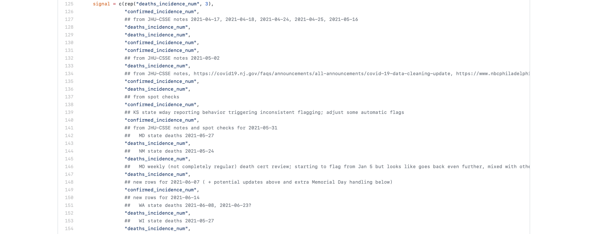
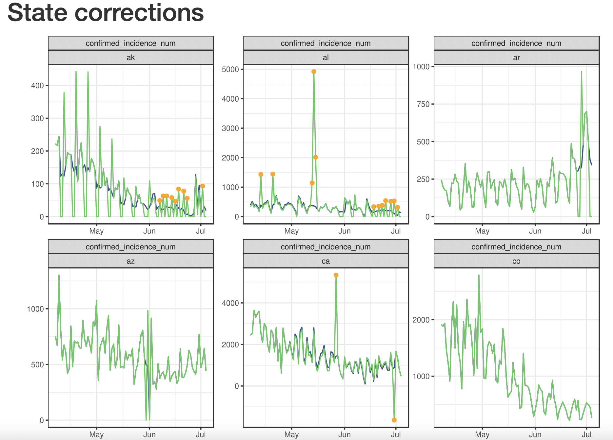
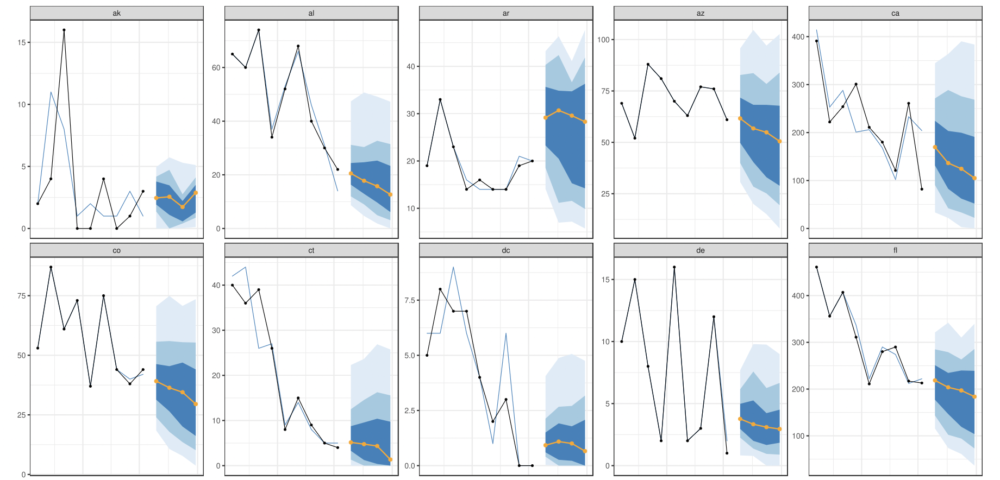

```{r, include = FALSE, message=FALSE, warning=FALSE}
knitr::opts_chunk$set(message=FALSE, warning=FALSE, 
                      cache=TRUE, autodep=TRUE,
                      echo = FALSE,
                      cache.comments=TRUE, fig.align = "center")
library(tidyverse)
library(lubridate)
library(cowplot)
library(knitr)
library(covidcast)

col = function(x, color = "#bb0000") {
  sprintf("<span style='color: %s;'>%s</span>", color, x)
}
```


# This Talk

Outline:

1. Background (context, teams, ensembling)
1. Our process (currently)
1. How have we done?
1. Lessons learned and thoughts


# `r col("1 Background", "white")` {.bigger} 

<h1><div style='text-align: center; padding: 225px 0px'> 
**1 Background (the task)** </div></h1>


# The task

* Every week, submit forecasts to [COVID-19 **Forecast**Hub](https://covid19forecasthub.org)
* We have now submitted 52 such forecasts (first on July 20, 2020)!
* Originally "State Deaths", added "County Cases" a bit later
* Hub also collects (now) a few other targets

# The goal

* Forecasts from many teams are combined into an "ensemble"
* The ensemble generally has the best performance
* Jacob, Logan, Aaron and others [worked hard](https://forecasters.org/blog/2020/10/28/comparing-ensemble-approaches-for-short-term-probabilistic-covid-19-forecasts-in-the-u-s/) creating the ensemble
* We want our forecasts to be "good enough" that they provide added value
* Plus, we're statisticians (and machine learners), so we should be good at this.

# The other teams

* Many different types of models / forecasts
* Some do pretty well, but many are ...
* Epidemiology models (SIR), Agent-based models, ML models
* Ours are (simple) ML, but other teams use Deep Learning
* You submit "point" forecasts and a set of "quantiles"
* Predict 1-4 epiweeks ahead (daily for hospitalizations)
* Some teams produce longer-term forecasts ...

# `r col("2 Current practice", "white")` {.bigger} 

<h1><div style='text-align: center; padding: 225px 0px'> 
**2 Producing the forecasts** </div></h1>


# Workflow

`r col("1. Sunday/Monday morning, make sure any data issues we know of are fixed")`

```{r, out.height = "90%"}

```


# Workflow

`r col("2. Flag and 'correct' other anomalies")`

```{r, eval=FALSE, echo = TRUE, class.source = "fold-show"}
# in the covid-19-forecast repo
zookeeper::make_state_corrector()
```

* This takes a "control theory" approach.
* Keep rolling measures of center and spread.
* Check if observations deviate too much.
* If yes, back-distribute the excess over some period.
* Fill in missing values.
* Handle intermittent (or regular) reporting issues (make simple predictions).

**Do these randomly so that we don't smooth the signal too much.**


# Making corrections

Some data has other obvious issues ...

```{r, fig.width=9, fig.height=5}
riga <- suppressMessages(covidcast_signal(
  "usa-facts","deaths_incidence_num", geo_type = "state",
  geo_values = c("ri","ga"), as_of = "2020-10-20"))
plot(filter(riga, geo_value=="ga"), 
     plot_type="line", title="usa-facts: deaths_incidence_num --- GA") +
  theme(legend.position = "none") +
  scale_color_manual(values = "darkblue")
```

# Making corrections

Some data has other obvious issues ...

```{r, fig.width=9, fig.height=5}
plot(filter(riga, geo_value=="ri"), 
     plot_type="line", title="usa-facts: deaths_incidence_num --- RI") +
  theme(legend.position = "none") +
  scale_color_manual(values = "orange")
```

# Making corrections

```{r, out.width="90%"}

```

# Daily vs. averages

* We make corrections to the daily data.
* We want to predict weekly totals.
* We actually predict weekly averages and multiply by 7.
* Averaging should remove weekly cycle.
* We then use "daily" data.
* Same for all locations (52 states or 200 counties).
* Forecast "rates" and then multiply by the population.

# Forecasters

`r col("3. Run the forecaster")`

* Use one "forecast template" to produce both forecasts
* Basic idea is "we use Quantile Autoregressive Models with Covariates"
* Use 21 days of training data (x `n_locations`)
* Plus more history to accomodate lags and so that we "see" the response

**States**: 0-1-2 weekly lags of deaths and 0-1-2 weekly lags of cases.

**Counties**: 
```{r, echo = FALSE}
list(cases = c(0, 1, 2, seq(3, 21, 3)), `fb-smoothed-hh-cli` = seq(3,28,7), `dv-smoothed-cli` = seq(3,28,7)) %>% str()
```

# Quality control

`r col("4. Look at the results")`

```{r, out.width="90%"}

```

# The system

`r col("5. The submission")`

* All of this is implemented in some packages and scripts.
* Runs every day with a Cron job in case of errors.
* Naras handled much of the backend.
* Logan manages the decisions (corrections, QC, other issues).
* Final submission is a PR to Reichlab.
* It was not always this smooth. 
* Required 10+ months and lots of hard work from lots of people to get here.


# `r col("Performance", "white")` {.bigger} 

<h1><div style='text-align: center; padding: 225px 0px'> 
**3 How have we done?** </div></h1>


# ForecastHub - All teams with more than 100 forecasts


```{r load-data, cache=TRUE}
library(evalcast)
library(aws.s3)
Sys.setenv("AWS_DEFAULT_REGION" = "us-east-2")
s3bucket <- get_bucket("forecast-eval")

death_scores <- s3readRDS("score_cards_state_deaths.rds", s3bucket) %>%
  select(ahead:forecast_date, target_end_date, 
         actual, wis, ae, cov_80, starts_with("value"))

GeoMean <- function(x, y = NULL, thresh = 1) {
  x <- x + thresh
  if (!is.null(y)) x <- x / (y + thresh)
  stopifnot(all(x > 0, na.rm = TRUE))
  exp(mean(log(x), na.rm = TRUE))
}
baseline <- death_scores %>% 
  filter(forecaster == "COVIDhub-baseline") %>%
  select(geo_value, ahead, target_end_date, wis) %>%
  rename(baseline_wis = wis)
death_scores <- death_scores %>% left_join(baseline) 
```

```{r grab-cmu}
cmu_preds <- get_covidhub_predictions(
  "CMU-TimeSeries", 
  ahead = 1:4,
  geo_type="state",
  response_signal="deaths_incidence_num")
```

```{r, fig.width=9, fig.height=5, fig.align="center"}
options(digits = 3)
library(plotly)
overall <- death_scores %>%
  group_by(forecaster, ahead) %>%
  summarise(wis = GeoMean(wis, baseline_wis), n = n()) 

p <- overall %>%
  filter(n > 100) %>%
  ggplot(aes(n, wis, color = forecaster)) + 
  geom_point() + 
  xlab("submitted forecasts") +
  ylab("geometric mean of wis relative to baseline") +
  facet_wrap(~ahead, nrow = 2, labeller = label_both) +
  scale_y_log10() +
  scale_x_log10() +
  theme_bw() +
  scale_color_viridis_d() +
  theme(legend.position = "none") +
  geom_hline(yintercept = 1)
ggplotly(p)
```

```{r grab-best}
best_fcasters <- overall %>% 
  group_by(forecaster) %>% 
  summarise(n = sum(n), wis = GeoMean(wis, thresh = 0)) %>%
  filter(wis < .8, n > 10000) %>%
  arrange(wis) %>%
  pull(forecaster)
#best_fcasters <- union(best_fcasters, "COVIDhub-trained_ensemble")
```

# Performance over time (only teams that are better than us!)

```{r, fig.width=10, fig.height=8}
best_scores <- filter(death_scores, forecaster %in% best_fcasters)

best_scores %>%
  mutate(ahead = as.character(ahead)) %>%
  group_by(forecaster, ahead, target_end_date) %>%
  summarise(wis = GeoMean(wis, baseline_wis)) %>%
  ggplot(aes(target_end_date, wis, color = forecaster)) +
  facet_wrap(~ahead, nrow = 4, scales = "free_y") +
  ylab("geometric mean of wis relative to baseline") +
  xlab("target date") +
  geom_line(size = 0.5, na.rm = TRUE) +
  scale_color_brewer(palette = "Set1") +
  theme_bw() +
  geom_hline(yintercept = 1) +
  theme(legend.position = "right", legend.title = element_blank())
```

# Calibration (all time)

```{r get-actuals}
actuals <- suppressMessages(
  covidcast_signal("jhu-csse", "deaths_7dav_incidence_num", 
                   geo_type = "state"))
actuals <- actuals %>%
  filter(wday(time_value) == 7) %>%
  select(geo_value, time_value, value) %>%
  rename(target_end_date = time_value, actual = value) %>%
  mutate(actual = actual * 7)
```

```{r join-em}
cmu <- left_join(cmu_preds, actuals)
```

```{r plot-calibration-all, fig.height=6, fig.width=8}
calib <- filter(cmu, !is.na(quantile)) %>%
  mutate(below = actual < value, above = actual > value) %>%
  group_by(ahead, quantile) %>%
  summarise(prop_below = mean(below, na.rm = TRUE),
            prop_above = mean(above, na.rm = TRUE)) %>%
  rename(nominal_prob = quantile)

calib %>%
  mutate(ahead = as.factor(ahead)) %>%
  ggplot(aes(nominal_prob, prop_below, color = ahead)) +
  geom_abline(slope = 1, intercept = 0) +
  labs(x = "Quantile level", y = "Proportion") + 
  geom_line() +
  scale_color_viridis_d() +
  coord_cartesian(ylim=c(0,1), xlim=c(0,1), expand = FALSE) +
  theme_bw() +
  guides("legend", title = "ahead")
```

# Calibration (since March 2021)

```{r plot-calibration-recent, fig.height = 6, fig.width=8}
calib <- filter(cmu, !is.na(quantile)) %>%
  mutate(below = actual < value, above = actual > value) %>%
  group_by(ahead, quantile) %>%
  filter(forecast_date > "2021-03-01") %>%
  summarise(prop_below = mean(below, na.rm = TRUE),
            prop_above = mean(above, na.rm = TRUE)) %>%
  rename(nominal_prob = quantile)

calib %>%
  mutate(ahead = as.factor(ahead)) %>%
  ggplot(aes(nominal_prob, prop_below, color = ahead)) +
  geom_abline(slope = 1, intercept = 0) +
  labs(x = "Quantile level", y = "Proportion") + 
  geom_line() +
  scale_color_viridis_d() +
  coord_cartesian(ylim=c(0,1), xlim=c(0,1), expand = FALSE) +
  theme_bw() +
  guides("legend", title = "ahead")
```

# 80% Coverage

```{r coverage}
death_scores %>%
  filter(forecaster == "CMU-TimeSeries") %>%
  mutate(ahead = as.factor(ahead)) %>% 
  group_by(target_end_date, ahead) %>%
  summarize(cov_80 = mean(cov_80)) %>%
  ggplot(aes(target_end_date, cov_80, color = ahead)) +
  coord_cartesian(ylim = c(0,1), expand = FALSE) +
  geom_hline(yintercept = 0.8) +
  geom_line() +
  ylab("observed proportion in the interval") +
  scale_color_viridis_d() +
  theme_bw()
```

# Spatial performance

```{r maps}
score_map <- death_scores %>%
  filter(forecaster == "CMU-TimeSeries") %>%
  group_by(geo_value) %>%
  summarize(value = GeoMean(wis, baseline_wis)) %>%
  mutate(time_value = Sys.Date()) %>%
  as.covidcast_signal(signal = "wis", data_source = "CMU-TimeSeries",
                      geo_type = "state")

plot(score_map, choro_col = scales::viridis_pal()(3), 
     title = "Geometric mean of WIS relative to baseline")
```

# Our forecasts, NY

```{r}
fan_plot <- function(df, ylabel = "", quantiles = c(.1, .5, .9)) {
  reds =  RColorBrewer::brewer.pal(5,"Reds")[5:2]
  df <- df %>% 
    mutate(quantile = case_when(
      abs(quantile - quantiles[2]) < 1e-6 ~ "point",
      abs(quantile - quantiles[3]) < 1e-6 ~ "upper",
      abs(quantile - quantiles[1]) < 1e-6 ~ "lower",
      TRUE ~ "drop"
    )) %>%
    filter(quantile != "drop") %>%
    select(ahead, quantile, value, forecast_date, 
           target_end_date, actual) %>%
    pivot_wider(names_from = quantile, values_from = value) %>%
    mutate(ahead = as.factor(ahead))
  df %>% 
    ggplot(aes(target_end_date)) +
    geom_point(aes(y = point, group = forecast_date, color = ahead)) +
    scale_color_manual(values = reds) +
    ylab("") + xlab("") +
    geom_line(aes(y = point, group=forecast_date), color = reds[1]) +
    geom_line(aes(y = actual), color="blue") +
    # geom_point(aes(y = actual), color="blue") +
    geom_ribbon(aes(ymin=lower, ymax=upper, group=forecast_date), alpha=.2) +
    theme_bw() + theme(legend.position = "bottom")
}
```

```{r fan-plot-cmu-ny, fig.width=10}
fan_plot(cmu %>% filter(geo_value == "ny")) + ylab("deaths per epiweek")
```

# COVIDhub ensemble, NY

```{r ens-preds}
ens <- get_covidhub_predictions(
  "COVIDhub-ensemble", 
  ahead = 1:4,
  geo_type="state",
  response_signal="deaths_incidence_num") %>%
  filter(signal == "deaths_incidence_num")
ens <- left_join(ens, actuals)
```


```{r fan-plot-ens-ny, fig.width=10}
fan_plot(ens %>% filter(geo_value == "ny")) + ylab("deaths per epiweek")
```

# Our forecasts, Utah

```{r fan-plot-cmu-ut, fig.width=10}
fan_plot(cmu %>% filter(geo_value == "ut")) + ylab("deaths per epiweek")
```

# COVIDhub ensemble, Utah

```{r fan-plot-ens-ut,fig.width=10}
fan_plot(ens %>% filter(geo_value == "ut")) + ylab("deaths per epiweek")
```

# `r col("Performance", "white")` {.bigger} 

<h1><div style='text-align: center; padding: 225px 0px'> 
**4 Lessons and thoughts** </div></h1>

# This is really hard

* Only 15 teams beat the baseline (of those submitting over the whole period)
* The Ensemble is only about 32% better than the baseline (averaged over all tasks)
* We're about 22% better
* Over all time, we rank about 5 out of 65 teams 
* For County Cases, we are the best 
* But the problem is even harder, and we `r col("barely")` beat the baseline

<br><br>

`r col("Important lessons:")`

Out-of-sample evaluation (with proper as-of) is huge.

Modular "forecaster template" is really helpful.

Nonstationarity is hard.

# How hard is it?

```{r compare-1-to-4}
best_scores <- best_scores %>%
  left_join(best_scores %>% 
              filter(ahead == 1) %>% 
              select(target_end_date, geo_value, baseline_wis) %>%
              rename(bs1 = baseline_wis))

blah <- best_scores %>%
  filter(ahead %in% c(1,4)) %>%
  mutate(ahead = as.character(ahead)) %>%
  group_by(forecaster, ahead, target_end_date) %>%
  summarise(wis = GeoMean(wis, bs1)) 

blah2 <- best_scores %>%
  filter(ahead %in% c(1,4)) %>%
  mutate(ahead = as.character(ahead)) %>%
  group_by(forecaster, ahead) %>%
  summarise(wis = GeoMean(wis, bs1))

blah %>%
  ggplot(aes(target_end_date, wis, color = forecaster)) +
  facet_wrap(~ahead, nrow = 2, scales = "free_y") +
  ylab("geometric mean of wis relative to 1-ahead baseline") +
  xlab("target date") +
  geom_line(size = 0.5, na.rm = TRUE) +
  scale_color_brewer(palette = "Set1") +
  theme_bw() +
  geom_hline(yintercept = 1) +
  geom_hline(data = blah2, mapping = aes(yintercept = wis, color = forecaster)) +
  theme(legend.position = "bottom", legend.title = element_blank())
```

`r col("On an equal footing, the best model beats the baseline by 20%. But, give the baseline 3 weeks of data, then it beats the best model by 20%.")`

# Why so hard?

* Nonstationarity breaks intuition
    - Bias / Variance tradeoff is strange
    - Not clear that "direct" forecasts are still good
    - Can't predict policy changes, variants, vaccines, etc.
    - Hard to do "usual" things (CV, more data may hurt, degrees-of-freedom intuition breaks down)
* "Simple" models are bad at exponential things, but exponential models are awful at turning points.
* Everything is terrible after 4 weeks
* Data is `r col("very")` noisy and unreliable
    - You really need to do lots of automatic (and manual) corrections
    
# Quick thoughts on future directions

* Sensorizing / nowcasting 
* Predict upswings/downswings, then forecast (switching KF?)
* Interpolate different local models 
    - Rob and Elena looked at "smoothing" the direct forecasts. 
    - Try something complicated at 1-week ahead and decrease complexity
* Other models (e.g. the UMASS model) don't have to "see" the response. Maybe helps performance?

# Thanks

- This talk used the AWS scores from our dashboard. Would have been impossible otherwise (Jed, Kate, Eu Jing, Nat)
- Logan and Naras
- The Forecast (modeling / research / basketball) team  


<br>


 

