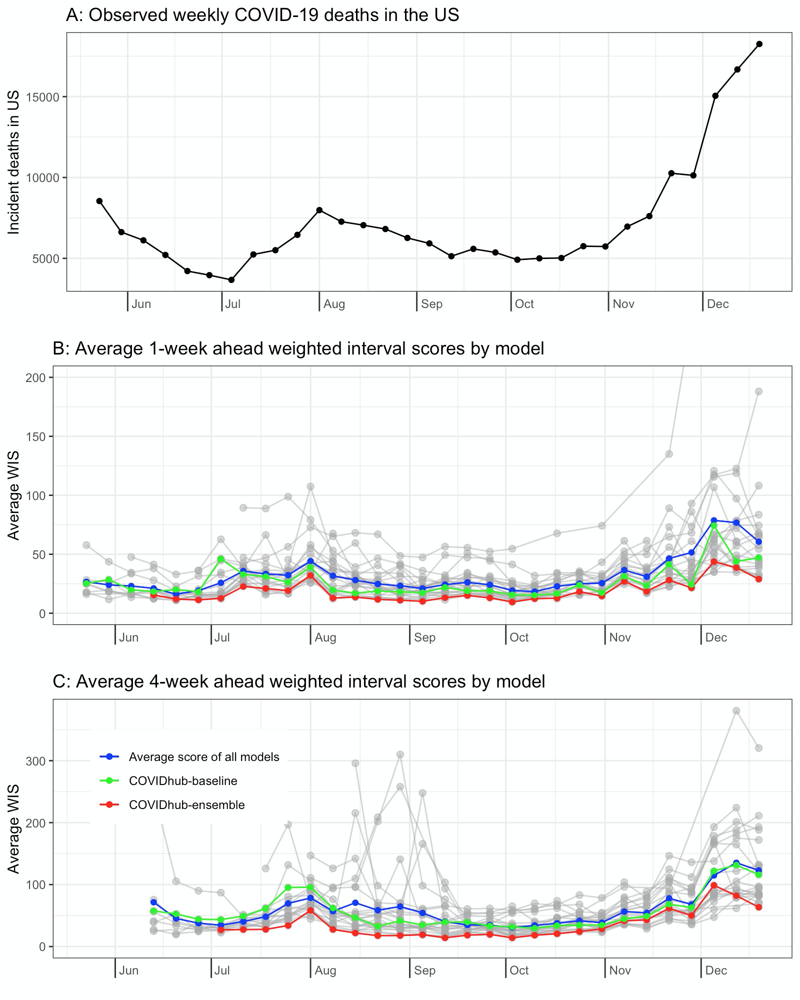
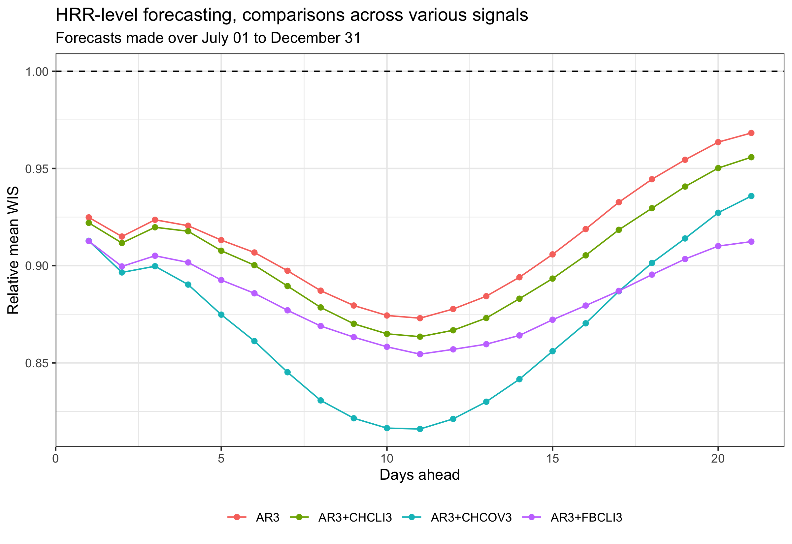
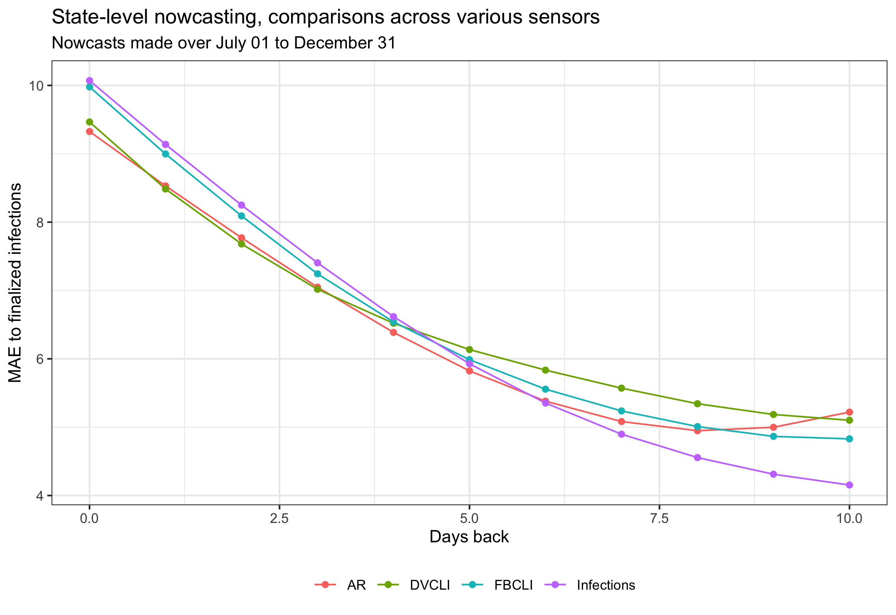

```{r, include = FALSE}
knitr::opts_chunk$set(message = FALSE, warning = FALSE, cache = TRUE, 
                      autodep = TRUE, cache.comments = TRUE)
library(dplyr)
library(purrr)
library(tidyr)
library(ggplot2)
library(gridExtra)
library(directlabels)

col = function(x, color = "#bb0000") {
  sprintf("<span style='color: %s;'>%s</span>", color, x)
}
```

# Delphi: Then and Now

- [Delphi](https://delphi.cmu.edu) formed in 2012, to "develop the theory and practice of epidemic forecasting"
- Participated in annual CDC flu forecasting challenges since 2013, earned top place in several 
- Awarded `r col("CDC's National Center of Excellence")` for flu forecasting in 2019 
- March 2020: pivoted to focus on supporting the US COVID-19 response, launched `r col("COVIDcast")`
- We've been working on the "full pipeline", but are focused now more than ever, on data

# COVIDcast Indicators


# COVIDcast Ecosystem


# Outline For This Talk

I can't cover all of this! I'll focus on our API and give some basic data demos (`r col("reproducible:")` all code included) then reflect on a few lessons learned

<br>

Outline:

- Part 1: API & data demos
- Part 2: Lessons learned

# `r col("Part 1: API & Data Demos", "white")` {.bigger} 

<div style='text-align: center; padding: 225px 0px'> 
**Part 1: API & Data Demos** </div>

# COVIDcast API 

The [COVIDcast API](https://cmu-delphi.github.io/delphi-epidata/api/covidcast.html) is based on HTTP GET queries and returns data in JSON or CSV format

| Parameter | Description | Examples |
| :-- | :-- | :-- |
| `data_source` | data source | `doctor-visits` or `fb-survey` |
| `signal` | signal derived from data source | `smoothed_cli` or `smoothed_adj_cli` |
| `time_type` | temporal resolution of the signal | `day` or `week` |
| `geo_type` | spatial resolution of the signal | `county`, `hrr`, `msa`, or `state` |
| `time_values` | time units over which events happened | `20200406` or `20200406-20200410` |
| `geo_value` | location codes, depending on `geo_type` | `*` for all, or `pa` for Pennsylvania |

# R and Python Packages

We also provide [R](https://cmu-delphi.github.io/covidcast/covidcastR/) and [Python](https://cmu-delphi.github.io/covidcast/covidcast-py/html/) packages for API access. Highlights: 

- Easy API querying:
    * Same specification structure (many default parameters) 
    * Full support for data revisions (as of, issues, lag)
- Basic signal processing:
    * Correlations sliced by location, or by time
    * Data wrangling: preparing signals for analysis
- Plotting functionality:
    * Choropleth and bubble maps, time series plots

(Have an idea? File an issue or contribute a PR on our [public GitHub repo](https://github.com/cmu-delphi/covidcast))

# List of Indicators 

```{r, R.options = list(width = 80)}
library(covidcast)
covidcast_meta() %>%
  group_by(data_source, signal) %>%
  summarize(county = ifelse("county" %in% geo_type, "*", ""),
            msa = ifelse("msa" %in% geo_type, "*", ""),
            hrr = ifelse("hrr" %in% geo_type, "*", ""),
            state = ifelse("state" %in% geo_type, "*", "")) %>%
  mutate(signal = ifelse(nchar(signal) <= 35, signal,
                         paste0(substr(signal, 1, 32), "..."))) %>%
  slice(grep("(raw|7dav|\\_w)", signal, invert = TRUE)) %>%
  as.data.frame() %>%
  print(right = FALSE, row.names = FALSE)
```

# Example: Deaths

How many COVID-19 deaths have been reported per day, in my state, since March 1?

```{r, fig.width = 8, fig.height = 5.5}
start_day = "2020-03-01"
end_day = "2021-04-28"
deaths = covidcast_signal(data_source = "usa-facts", 
                          signal = "deaths_7dav_incidence_num", 
                          start_day = start_day, end_day = end_day,
                          geo_type = "state", geo_values = "pa")

plot(deaths, plot_type = "line", 
     title = "New COVID-19 deaths in PA (7-day average)") + 
  scale_x_date(date_breaks = "1 month", date_labels = "%b") +
  theme(legend.position = "none")
```

# Example: Hospitalizations

What percentage of daily hospital admissions are due to COVID-19 in PA, NY, TX?

```{r, fig.width = 8, fig.height = 5.5}
hosp = covidcast_signal(data_source = "hospital-admissions", 
                        signal = "smoothed_adj_covid19_from_claims",
                        start_day = start_day, end_day = end_day,
                        geo_type = "state", geo_values = c("pa", "ny", "tx"))

plot(hosp, plot_type = "line", 
     title = "% of hospital admissions due to COVID-19") + 
  geom_dl(aes(y = value, color = geo_value, label = toupper(geo_value)), 
          method = "last.bumpup") +
  scale_x_date(date_breaks = "1 month", date_labels = "%b") +
  theme(legend.position = "none")
```

# Example: Total Cases

What does the current COVID-19 cumulative case rate look like, nationwide?

```{r, fig.width = 9, fig.height = 7}
cases = covidcast_signal(data_source = "usa-facts", 
                         signal = "confirmed_cumulative_prop",
                         start_day = end_day, end_day = end_day)

end_day_str = format.Date(end_day, "%B %d %Y")
plot(cases, title = "Cumulative COVID-19 cases per 100,000 people", 
     range = c(0, 12500), 
     choro_params = list(subtitle = end_day_str, legend_n = 6))
```

# Example: Doctor's Visits

How do some cities compare in terms of doctor's visits due to COVID-like illness?

```{r, fig.width = 8, fig.height = 6}
dv = covidcast_signal(data_source = "doctor-visits", 
                      signal = "smoothed_adj_cli", 
                      start_day = start_day, end_day = end_day,
                      geo_type = "msa", 
                      geo_values = name_to_cbsa(c("Miami", "New York", 
                                                  "Pittsburgh", "San Antonio")))

plot(dv, plot_type = "line", 
     title = "% of doctor's visits due to COVID-like illness") + 
  scale_x_date(date_breaks = "1 month", date_labels = "%b") +
  scale_color_hue(labels = cbsa_to_name(unique(dv$geo_value)))
```

# Example: Symptoms

How do my county and my friend's county compare in terms of COVID symptoms?

```{r, fig.width = 8, fig.height = 6}
sympt = covidcast_signal(data_source = "fb-survey", 
                         signal = "smoothed_hh_cmnty_cli",
                         start_day = "2020-04-15", end_day = end_day,
                         geo_values = c(name_to_fips("Allegheny"),
                                        name_to_fips("Fulton", 
                                                     state = "GA")))

plot(sympt, plot_type = "line", 
     title = "% of people who know somebody with COVID symptoms") + 
  scale_x_date(date_breaks = "1 month", date_labels = "%b") +
  scale_color_hue(labels = fips_to_name(unique(sympt$geo_value)))
```

# Example: Mask Use

How do some states compare in terms of self-reported mask useage?

```{r, fig.width = 8, fig.height = 5.5}
states = c("dc", "ma", "ny", "wy", "sd", "id")
mask1 = covidcast_signal(data_source = "fb-survey", 
                        signal = "smoothed_wwearing_mask",
                        start_day = "2020-09-15", end_day = "2021-02-10",
                        geo_type = "state", geo_values = states)
mask2 = covidcast_signal(data_source = "fb-survey", 
                        signal = "smoothed_wwearing_mask_7d", 
                        start_day = "2021-02-11", end_day = end_day,
                        geo_type = "state", geo_values = states)
mask = rbind(mask1, mask2)

plot(mask, plot_type = "line", 
     title = "% of people who wear masks in public most/all the time") +
  geom_dl(aes(y = value, color = geo_value, label = toupper(geo_value)), 
          method = "last.bumpup") +
  scale_x_date(date_breaks = "1 month", date_labels = "%b") +
  theme(legend.position = "none")
```

# Example: Vaccines

How about vaccine uptake (self-reported), and willingness to take vaccine (if not yet vaccinated)?

```{r, fig.width = 13, fig.height = 5.5}
states = c("dc", "ma", "ny", "wy", "sd", "id")
vaccine = covidcast_signals(data_source = "fb-survey", 
                            signal = c("smoothed_wcovid_vaccinated",
                                       "smoothed_waccept_covid_vaccine"),
                            start_day = "2021-01-15", end_day = end_day,
                            geo_type = "state", geo_values = states)

g1 = plot(vaccine[[1]], plot_type = "line", 
     title = "% of people who have received COVID-19 vaccine, self-reported") +
  geom_dl(aes(y = value, color = geo_value, label = toupper(geo_value)), 
          method = "last.bumpup") +
  scale_x_date(date_breaks = "1 month", date_labels = "%b") +
  theme(legend.position = "none")
g2 = plot(vaccine[[2]], plot_type = "line", 
     title = "% of people who would accept COVID-19 vaccine, if haven't yet") +
  geom_dl(aes(y = value, color = geo_value, label = toupper(geo_value)), 
          method = "last.bumpup") +
  scale_x_date(date_breaks = "1 month", date_labels = "%b") +
  theme(legend.position = "none")
grid.arrange(g1, g2, nrow = 1)
```

# As Of, Issues, Lag

By default the API returns the most recent data for each `time_value`. We also provide access to all previous versions of the data, using the following optional parameters:

| Parameter | To get data ... | Examples |
| :-- | :-- | :-- |
| `as_of` | as if we queried the API on a particular date | `20200406` |
| `issues` | published at a particular date or date range | `20200406` or `20200406-20200410` |
| `lag` | published a certain number of time units after events occured | `1` or `3` |

# Data Revisions 

Why would we need this? Because many data sources are subject to `r col("revisions:")`

- Case and death counts frequently corrected/adjusted by authorities
- Medical claims data can take weeks to be submitted and/or processed
- Testing/lab data can be backlogged for a variety of reasons, etc.

This presents a challenge to modelers: e.g., we have to learn how to forecast based on the `r col("data we'd have at the time")`, not updates that would arrive later. To accommodate, we log revisions even when the original data source does not!

# Example: Backfill in Doctor's Visits

The last two weeks of August in CA ...

```{r, fig.width = 8, fig.height = 5}
# Let's get the data that was available as of 09/22, for the end of August in CA
dv = covidcast_signal(data_source = "doctor-visits", 
                      signal = "smoothed_adj_cli",
                      start_day = "2020-08-15", end_day = "2020-08-31",
                      geo_type = "state", geo_values = "ca",
                      as_of = "2020-09-21")

# Plot the time series curve
xlim = c(as.Date("2020-08-15"), as.Date("2020-09-21"))
ylim = c(3.83, 5.92)
ggplot(dv, aes(x = time_value, y = value)) + 
  geom_line() +
  coord_cartesian(xlim = xlim, ylim = ylim) +
  geom_vline(aes(xintercept = as.Date("2020-09-21")), lty = 2) +
  labs(color = "as of", x = "Date", y = "% doctor's visits due to CLI in CA") +
  theme_bw() + theme(legend.position = "bottom")
```

# Example: Backfill in Doctor's Visits (Cont.)

The last two weeks of August in CA ...

```{r, fig.width = 8, fig.height = 5}
# Now loop over a bunhch of "as of" dates, fetch data from the API for each one
as_ofs = seq(as.Date("2020-09-01"), as.Date("2020-09-21"), by = "week")
dv_as_of = map_dfr(as_ofs, function(as_of) {
  covidcast_signal(data_source = "doctor-visits", signal = "smoothed_adj_cli",
                   start_day = "2020-08-15", end_day = "2020-08-31", 
                   geo_type = "state", geo_values = "ca", as_of = as_of)
})

# Plot the time series curve "as of" September 1
dv_as_of %>% 
  filter(issue == as.Date("2020-09-01")) %>% 
  ggplot(aes(x = time_value, y = value)) + 
  geom_line(aes(color = factor(issue))) + 
  coord_cartesian(xlim = xlim, ylim = ylim) +
  geom_vline(aes(color = factor(issue), xintercept = issue), lty = 2) +
  labs(color = "as of", x = "Date", y = "% doctor's visits due to CLI in CA") +
  geom_line(data = dv, aes(x = time_value, y = value)) +
  geom_vline(aes(xintercept = as.Date("2020-09-21")), lty = 2) +
  theme_bw() + theme(legend.position = "none")
```

# Example: Backfill in Doctor's Visits (Cont.)

The last two weeks of August in CA ...

```{r, fig.width = 8, fig.height = 5}
dv_as_of %>% 
  ggplot(aes(x = time_value, y = value)) + 
  geom_line(aes(color = factor(issue))) + 
  coord_cartesian(xlim = xlim, ylim = ylim) +
  geom_vline(aes(color = factor(issue), xintercept = issue), lty = 2) +
  labs(color = "as of", x = "Date", y = "% doctor's visits due to CLI in CA") +
  geom_line(data = dv, aes(x = time_value, y = value)) +
  geom_vline(aes(xintercept = as.Date("2020-09-21")), lty = 2) +
  theme_bw() + theme(legend.position = "none")
```

# Ongoing Pandemic Survey

Through recruitment partnership with Facebook, we survey about `r col("50,000 people daily")` (and over 20 million since it began in April), in the US. Topics include:

- COVID symptoms (common and rare)
- COVID testing
- Mental health
- Social contacts and behavior
- Demographics

This is the largest non-Census research survey `r col("ever conducted")`. Raw survey response data is available to researchers under a [data use agreement](https://dataforgood.fb.com/docs/covid-19-symptom-survey-request-for-data-access/). A [parallel, international effort](https://covidmap.umd.edu/) by the University of Maryland reaches 100+ countries in 55 languages

# `r col("Part 2: Lessons Learned", "white")` {.bigger} 

<div style='text-align: center; padding: 225px 0px'> 
**Part 2: Lessons Learned** </div>

# Lessons and Reflections

An attempt to distill some `r col("lessons learned")` from the past year, related to statistical modeling and machine learning, broken down by three areas:

- A. Forecasting
- B. Nowcasting
- C. Risk taking

# A: Forecasting in a Pandemic is Hard

The [COVID-19 Forecast Hub](https://github.com/reichlab/covid19-forecast-hub) collects short-term forecasts of incident COVID-19 cases, hospitalizations, and deaths. These are made by 50+ groups of "citizen scientists", and power the [CDC's official communications](https://www.cdc.gov/coronavirus/2019-ncov/covid-data/forecasting-us.html) on COVID-19 forecasting

<br>

This is `r col("not an easy problem:")`

- Signal-to-noise is generally quite low (all we have is a small set of correlated examples)
- Nonstationarity is generally quite pronounced (the disease and the way we're measuring it)
- Data problems are a constant struggle (delays, revisions, anomalies, changes in definitions)

(All of this---plus an additional model-level nonstationarity---carries over to `r col("building an ensemble model")`!)

# A: Forecasting in a Pandemic is Hard (Cont.)

Only a small handful of models consistently outperform the baseline (essentially the flat-line forecaster). For example, from [Cramer et al. (2021)](https://www.medrxiv.org/content/10.1101/2021.02.03.21250974v1.full.pdf): 

<br>



# A: Forecasting in a Pandemic is Hard (Cont.)

Lessons/reflections: 

- Simple, robust models (mechanistic or statistical) tend to perform best  
<!-- E.g., best national death forecaster for a long stretch was CFR = 1.7% at 22 day lag
The same can be said here, with respect to simplicity & robustness about the ensemble -->
- We (as a community) missed every surge, didn't clearly pass `r col("\"eyeball test\"")`
- Continual, direct engagement with the `r col("end users")` of forecasts is critical
<!-- Problem abstractions and scoring rules may to themselves be continually adjusted -->

<!--Short-term forecasting is hard enough ... where does that leave long-term, counterfactual forecasting?-->

# B. Nowcasting is Dark Horse Candidate for MVP

`r col("Nowcasting:")` estimating the value of a signal that will only be fully-observed at a later date. Current data is partial/noisy, but progressively improves as time passes

<br>

Example: suppose we want to use medical insurance claims to estimate how many people have some disease on some day (in some location)

- Claims are routinely submitted/processed late
- Holidays can be particularly troublesome
- Finalized values will only be available months later

<!--
"Classic" example: nowcasting in `r col("ILINet")`, the [CDC's influenza surveillance system](https://www.cdc.gov/flu/weekly/overview.htm#anchor_1539281266932) based on reports from outpatient healthcare providers-->

# B. Nowcasting is Dark Horse Candidate for MVP (Cont.)

Meanwhile, in COVID-19, it's even more complicated:

- We'd like to know many infected individuals are currently present, in a population
- We'd settle for how many *symptomatic* infections are currently present
- We'd even settle for counting current symptomatic infections that *eventually get tested*
- Instead, we get how many confirmed symptomatic infections *happened to be reported that day* <!--(to the county/state/CDC)-->

Even settling for the penultimate bullet, we would be nowcasting a `r col("latent variable")` (never observed)

# B. Nowcasting is Dark Horse Candidate for MVP (Cont.)


# B. Nowcasting is Dark Horse Candidate for MVP (Cont.)

Lessons/reflections:

- We need more people to work on nowcasting, it is extremely relevant
- Compared to forecasting, it still technically quite underdeveloped
- Good answers could `r col("redefine ground-truth")` (i.e., forecasting targets)

While time scales may change, nowcasting is not going away as a central problem in public health ...

# C. Taking Risks (When You Can Afford To Do So)

The beginning of the pandemic created a clear pull for computational scientists: fetch case and death data from JHU CSSE's GitHub, learn about SIR modeling, inject stochasticity, start making forecasts

We decided early on to swim against the stream. It's not that this work wasn't important, but rather, we felt we could `r col("create greater")` value by working on the `r col("data problem")` (to hopefully benefit many others) <!-- fellow modelers, data journalists, decision-makers, and the general public)-->

We wouldn't/couldn't have taken this risk if there weren't so many strong computational scientists who jumped into work on forecasting

# C. Taking Risks (When You Can Afford To Do So, Cont.)

It can be `r col("hard to quantify")` the value of good data. We will be trying to do this for years to come (not just us/our data ... this is an important undertaking for the whole scientific community)

That said, we are starting to see (in retrospect) some `r col("encouraging results")` in problems where you can quantify value, like forecasting and nowcasting

<br>





# Thanks

- The [whole Delphi team](https://delphi.cmu.edu/about/team/), and various CMU units
- Google, Facebook, Amazon Web Services
- Change Healthcare, Quidel, SafeGraph, Qualtrics
- Reich Lab at University of Massachusetts
- Centers for Disease Control and Prevention

For more, visit <https://covidcast.cmu.edu> (you'll find everything linked from there)